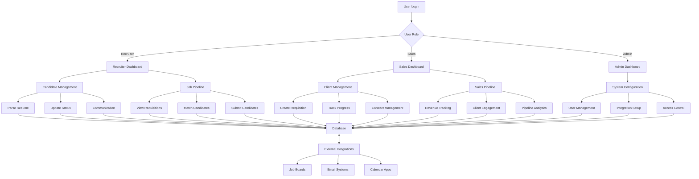
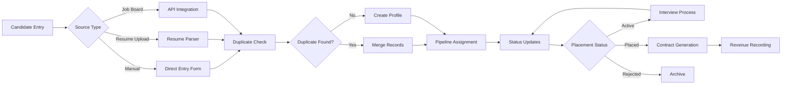
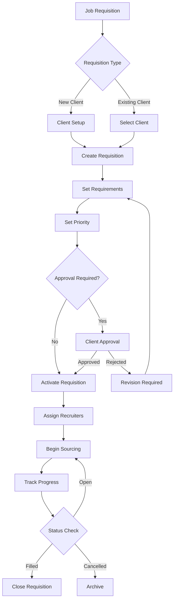
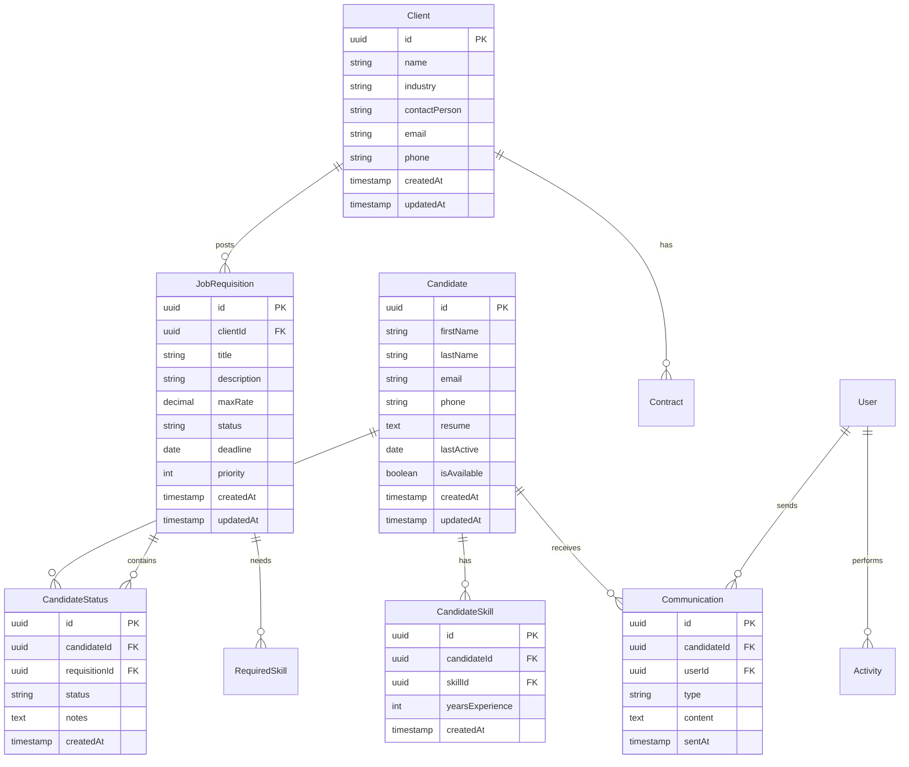
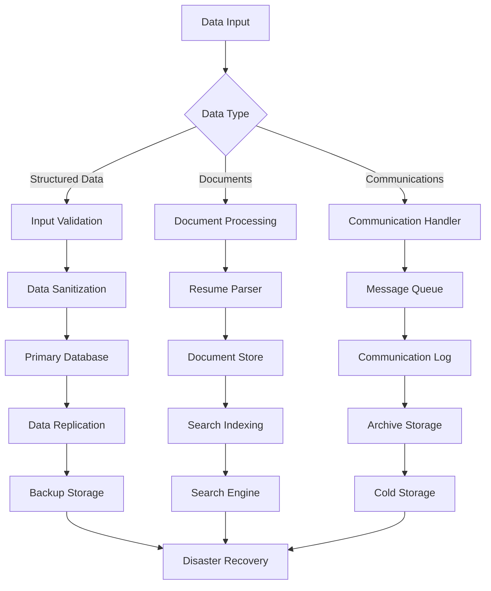
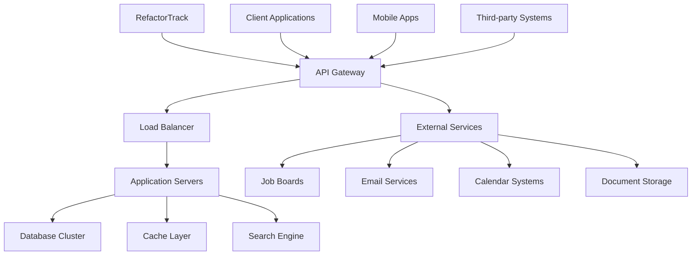

# Product Requirements Document (PRD)

# 1. INTRODUCTION

## 1.1 Purpose

This Software Requirements Specification (SRS) document provides a comprehensive description of the RefactorTrack Applicant Tracking System. It details the functional and non-functional requirements for development teams, stakeholders, and project managers involved in the system's implementation. This document serves as the primary reference for technical requirements, system behavior, and project scope throughout the development lifecycle.

## 1.2 Scope

RefactorTrack is a cloud-based Applicant Tracking System specifically designed for technology recruiting and staffing agencies. The system encompasses:

- Candidate management and tracking
- Job requisition handling
- Client relationship management
- Analytics and reporting capabilities
- Integration with external platforms
- Collaboration tools for sales and recruiting teams

### Core Functionalities

| Feature Category | Key Components |
|-----------------|----------------|
| Candidate Management | - Centralized database<br>- Resume parsing<br>- Status tracking<br>- Communication history |
| Requisition Management | - Job board<br>- Pipeline tracking<br>- Requisition details<br>- Priority management |
| Sales Tools | - Client profiles<br>- Pipeline monitoring<br>- Contract management<br>- Revenue tracking |
| Analytics | - Recruiter metrics<br>- Sales metrics<br>- Custom dashboards<br>- Source tracking |

### Key Benefits

1. Increased recruiter efficiency through streamlined workflows
2. Enhanced sales team productivity via integrated CRM features
3. Improved collaboration between recruiting and sales departments
4. Data-driven decision making through comprehensive analytics
5. Reduced time-to-hire and improved candidate placement rates

The system will be developed using cloud infrastructure (AWS/Azure/GCP) and will maintain compliance with data protection regulations including GDPR.

# 2. PRODUCT DESCRIPTION

## 2.1 Product Perspective

RefactorTrack operates as a cloud-based SaaS solution within the broader technology recruitment ecosystem. The system:

- Integrates with existing job boards, email systems, and calendar platforms
- Operates independently of other internal systems while maintaining API compatibility
- Utilizes cloud infrastructure (AWS/Azure/GCP) for scalability and reliability
- Functions as a web-based application accessible through modern browsers
- Maintains data synchronization with external platforms through REST APIs

## 2.2 Product Functions

| Function Category | Core Capabilities |
|------------------|-------------------|
| Candidate Management | - Resume parsing and storage<br>- Automated duplicate detection<br>- Status tracking and pipeline management<br>- Communication history logging |
| Requisition Handling | - Job posting creation and distribution<br>- Pipeline status monitoring<br>- Priority management<br>- Client requirement tracking |
| Sales Operations | - Client relationship management<br>- Revenue tracking<br>- Contract management<br>- Pipeline analytics |
| Reporting | - Custom dashboard creation<br>- Performance metrics tracking<br>- Source effectiveness analysis<br>- ROI calculations |

## 2.3 User Characteristics

### Technical Recruiters
- Proficiency: Intermediate technical knowledge
- Usage: Daily, heavy usage of candidate management features
- Focus: Candidate sourcing, screening, and placement
- Access Level: Full access to recruitment functions

### Sales Representatives
- Proficiency: Basic to intermediate technical knowledge
- Usage: Regular usage of CRM and pipeline features
- Focus: Client relationship management and requisition tracking
- Access Level: Full access to sales functions

### System Administrators
- Proficiency: Advanced technical knowledge
- Usage: Periodic system maintenance and configuration
- Focus: System setup, user management, and integrations
- Access Level: Complete system access

## 2.4 Constraints

1. Technical Constraints
   - Browser compatibility limited to modern versions of Chrome, Firefox, Safari, and Edge
   - Maximum file size of 25MB for resume uploads
   - API rate limits for external integrations

2. Regulatory Constraints
   - GDPR compliance requirements for data handling
   - Data retention policies for candidate information
   - Privacy regulations for international operations

3. Business Constraints
   - Initial deployment limited to English language
   - Maximum user limit based on subscription tier
   - Storage limitations based on pricing plan

## 2.5 Assumptions and Dependencies

### Assumptions
1. Users have stable internet connectivity
2. Clients and candidates provide accurate information
3. External APIs maintain current specifications
4. Users have basic computer literacy

### Dependencies
1. External Services
   - Job board API availability
   - Email service provider uptime
   - Calendar system integration stability

2. Infrastructure
   - Cloud provider service availability
   - Database backup and recovery systems
   - Content delivery network performance

3. Third-Party Tools
   - Resume parsing service functionality
   - Payment gateway operations
   - Authentication service reliability

# 3. PROCESS FLOWCHART







# 4. FUNCTIONAL REQUIREMENTS

## 4.1 Candidate Management

### ID: F-CM-001
**Description**: Centralized candidate database with advanced search capabilities  
**Priority**: High

| Requirement ID | Requirement Description | Acceptance Criteria |
|---------------|------------------------|-------------------|
| F-CM-001.1 | System shall provide a unified database to store candidate profiles | - Supports minimum 1M candidate records<br>- Accessible through web interface<br>- Searchable by multiple criteria |
| F-CM-001.2 | System shall implement advanced search filters | - Filter by skills, experience, location<br>- Support Boolean search operators<br>- Save search preferences |
| F-CM-001.3 | System shall prevent duplicate entries | - Auto-detect duplicates based on email/phone<br>- Suggest merge options<br>- Maintain audit trail of merges |

### ID: F-CM-002
**Description**: Resume parsing and data extraction  
**Priority**: High

| Requirement ID | Requirement Description | Acceptance Criteria |
|---------------|------------------------|-------------------|
| F-CM-002.1 | System shall automatically parse uploaded resumes | - Support PDF, DOC, DOCX formats<br>- Extract key fields (contact, skills, experience)<br>- Complete parsing within 30 seconds |
| F-CM-002.2 | System shall allow manual data correction | - Edit parsed fields<br>- Highlight uncertain extractions<br>- Save parsing preferences |

## 4.2 Job Requisition Management

### ID: F-JR-001
**Description**: Comprehensive job requisition tracking system  
**Priority**: High

| Requirement ID | Requirement Description | Acceptance Criteria |
|---------------|------------------------|-------------------|
| F-JR-001.1 | System shall maintain a job board | - Display all active requisitions<br>- Filter by status, client, priority<br>- Sort by various parameters |
| F-JR-001.2 | System shall track pipeline status | - Real-time status updates<br>- Visual pipeline representation<br>- Automated status notifications |

## 4.3 Sales Operations

### ID: F-SO-001
**Description**: Client relationship management features  
**Priority**: Medium

| Requirement ID | Requirement Description | Acceptance Criteria |
|---------------|------------------------|-------------------|
| F-SO-001.1 | System shall manage client profiles | - Store client details and history<br>- Track engagement metrics<br>- Maintain communication logs |
| F-SO-001.2 | System shall track revenue | - Calculate placement fees<br>- Generate revenue reports<br>- Track targets vs. actuals |

## 4.4 Reporting and Analytics

### ID: F-RA-001
**Description**: Comprehensive reporting system  
**Priority**: Medium

| Requirement ID | Requirement Description | Acceptance Criteria |
|---------------|------------------------|-------------------|
| F-RA-001.1 | System shall generate standard reports | - Recruiter performance metrics<br>- Sales pipeline analytics<br>- Source effectiveness reports |
| F-RA-001.2 | System shall support custom dashboards | - Configurable widgets<br>- Role-based dashboard templates<br>- Export capabilities |

## 4.5 Integration Capabilities

### ID: F-IC-001
**Description**: External system integrations  
**Priority**: Medium

| Requirement ID | Requirement Description | Acceptance Criteria |
|---------------|------------------------|-------------------|
| F-IC-001.1 | System shall integrate with job boards | - Bi-directional data sync<br>- Support major job boards<br>- Error handling and logging |
| F-IC-001.2 | System shall integrate with email/calendar | - Outlook/Gmail integration<br>- Calendar sync<br>- Email tracking |

## 4.6 Collaboration Tools

### ID: F-CT-001
**Description**: Team collaboration features  
**Priority**: Low

| Requirement ID | Requirement Description | Acceptance Criteria |
|---------------|------------------------|-------------------|
| F-CT-001.1 | System shall support shared notes | - Add/edit/delete notes<br>- Tag team members<br>- Notification system |
| F-CT-001.2 | System shall provide activity feeds | - Real-time updates<br>- Filterable activity stream<br>- User mentions |

# 5. NON-FUNCTIONAL REQUIREMENTS

## 5.1 Performance Requirements

| Requirement ID | Description | Target Metric |
|---------------|-------------|---------------|
| NFR-P-001 | Page Load Time | < 2 seconds for 95% of requests |
| NFR-P-002 | API Response Time | < 500ms for 99% of API calls |
| NFR-P-003 | Resume Parsing | < 30 seconds per document |
| NFR-P-004 | Database Query Time | < 200ms for complex searches |
| NFR-P-005 | Concurrent Users | Support 1000+ simultaneous users |
| NFR-P-006 | File Upload Size | Support up to 25MB per file |
| NFR-P-007 | Search Results | Return within 3 seconds for complex queries |

## 5.2 Safety Requirements

| Requirement ID | Description | Implementation |
|---------------|-------------|----------------|
| NFR-S-001 | Data Backup | Daily automated backups with 30-day retention |
| NFR-S-002 | Disaster Recovery | RTO < 4 hours, RPO < 1 hour |
| NFR-S-003 | Data Validation | Input validation for all user-submitted data |
| NFR-S-004 | Error Handling | Graceful error handling with user notifications |
| NFR-S-005 | Session Management | Automatic timeout after 30 minutes of inactivity |
| NFR-S-006 | Change Tracking | Full audit trail of all data modifications |

## 5.3 Security Requirements

| Requirement ID | Description | Specification |
|---------------|-------------|---------------|
| NFR-SEC-001 | Authentication | Multi-factor authentication support |
| NFR-SEC-002 | Authorization | Role-based access control (RBAC) |
| NFR-SEC-003 | Data Encryption | AES-256 encryption at rest |
| NFR-SEC-004 | Transport Security | TLS 1.3 for all communications |
| NFR-SEC-005 | Password Policy | Minimum 12 characters with complexity requirements |
| NFR-SEC-006 | Security Logging | Comprehensive security event logging |
| NFR-SEC-007 | API Security | OAuth 2.0 and JWT implementation |

## 5.4 Quality Requirements

### 5.4.1 Availability
- System uptime: 99.9% excluding planned maintenance
- Planned maintenance windows: Monthly, off-peak hours
- Automatic failover capabilities

### 5.4.2 Maintainability
- Modular architecture for easy updates
- Comprehensive API documentation
- Automated deployment pipeline
- Regular security patches and updates

### 5.4.3 Usability
- Intuitive navigation requiring minimal training
- Mobile-responsive design
- Accessibility compliance with WCAG 2.1 Level AA
- Multi-language support (English initial release)

### 5.4.4 Scalability
- Horizontal scaling capability
- Auto-scaling based on load
- Database partitioning support
- Content Delivery Network integration

### 5.4.5 Reliability
- Mean Time Between Failures (MTBF): > 720 hours
- Mean Time To Recovery (MTTR): < 1 hour
- Automated system health monitoring
- Regular backup verification

## 5.5 Compliance Requirements

| Requirement ID | Description | Standard/Regulation |
|---------------|-------------|-------------------|
| NFR-C-001 | Data Protection | GDPR compliance |
| NFR-C-002 | Data Retention | Industry-specific retention policies |
| NFR-C-003 | Accessibility | WCAG 2.1 Level AA |
| NFR-C-004 | Privacy | CCPA compliance |
| NFR-C-005 | Security Standards | SOC 2 Type II compliance |
| NFR-C-006 | API Standards | OpenAPI Specification 3.0 |
| NFR-C-007 | Cloud Security | CSA STAR certification |

# 6. DATA REQUIREMENTS

## 6.1 Data Models



## 6.2 Data Storage

### 6.2.1 Primary Storage
- Primary database: PostgreSQL for structured data
- Document store: MongoDB for resume storage and parsing results
- Search engine: Elasticsearch for candidate and job search capabilities

### 6.2.2 Data Retention
| Data Type | Retention Period | Storage Type |
|-----------|-----------------|--------------|
| Active Candidates | Indefinite | Primary Database |
| Archived Candidates | 5 years | Cold Storage |
| Communications | 3 years | Primary Database |
| Resumes | 5 years | Document Store |
| Activity Logs | 1 year | Time-series Database |
| Audit Trails | 7 years | Compliance Storage |

### 6.2.3 Backup and Recovery
- Daily incremental backups
- Weekly full backups
- Cross-region replication
- Point-in-time recovery capability
- 30-day backup retention
- 15-minute Recovery Point Objective (RPO)
- 4-hour Recovery Time Objective (RTO)

## 6.3 Data Processing



### 6.3.1 Data Security
| Security Layer | Implementation |
|----------------|----------------|
| Encryption at Rest | AES-256 encryption |
| Encryption in Transit | TLS 1.3 |
| Access Control | Role-based access with JWT |
| Data Masking | PII masking for non-privileged users |
| Audit Logging | All data modifications logged |
| Key Management | AWS KMS/Azure Key Vault |

### 6.3.2 Data Validation
- Input sanitization for all user-submitted data
- Schema validation for structured data
- File type verification for documents
- Size limits enforcement
- Duplicate detection
- Data integrity checks

### 6.3.3 Data Integration
- REST API endpoints for external systems
- Batch processing for large data imports
- Real-time event streaming for updates
- ETL pipelines for reporting
- Data synchronization protocols

# 7. EXTERNAL INTERFACES

## 7.1 User Interfaces

### 7.1.1 Web Application Interface

| Component | Requirements |
|-----------|--------------|
| Browser Support | Chrome 90+, Firefox 88+, Safari 14+, Edge 90+ |
| Screen Resolution | Minimum 1366x768, Responsive up to 4K |
| Color Scheme | WCAG 2.1 Level AA compliant contrast ratios |
| Layout | Responsive grid system with breakpoints at 768px, 992px, 1200px |
| Navigation | Persistent top navigation bar with role-based menu items |

### 7.1.2 Mobile Interface

| Component | Requirements |
|-----------|--------------|
| Device Support | iOS 14+ and Android 10+ |
| Orientation | Support both portrait and landscape modes |
| Touch Interface | Support for standard touch gestures |
| Offline Capability | Basic read-only functionality when offline |

## 7.2 Software Interfaces

### 7.2.1 External Service Integrations

| Service Type | Interface Specification | Protocol |
|-------------|------------------------|-----------|
| Job Boards | REST APIs with OAuth 2.0 | HTTPS |
| Email Systems | SMTP, IMAP, Exchange Web Services | TLS 1.3 |
| Calendar Services | CalDAV, iCalendar | HTTPS |
| Document Storage | AWS S3 API, Azure Blob Storage | HTTPS |
| Resume Parser | REST API with JWT authentication | HTTPS |

### 7.2.2 Database Interfaces

| Database | Interface Type | Purpose |
|----------|---------------|----------|
| PostgreSQL | Native PostgreSQL Protocol | Primary data storage |
| MongoDB | MongoDB Wire Protocol | Document storage |
| Elasticsearch | REST API | Search functionality |
| Redis | Redis Protocol | Caching layer |

## 7.3 Communication Interfaces

### 7.3.1 Network Protocols

| Protocol | Usage | Specification |
|----------|-------|---------------|
| HTTPS | All web traffic | TLS 1.3 |
| WebSocket | Real-time updates | WSS (Secure WebSocket) |
| SMTP | Email communication | TLS-enabled |
| REST | API communications | JSON over HTTPS |

### 7.3.2 Integration Formats

| Format | Usage | Schema |
|--------|-------|---------|
| JSON | API data exchange | OpenAPI 3.0 |
| XML | Legacy system integration | XML Schema 1.1 |
| CSV | Data import/export | RFC 4180 |
| PDF | Document handling | PDF 1.7 |

### 7.3.3 API Specifications

```yaml
openapi: 3.0.0
paths:
  /api/v1/candidates:
    get:
      security:
        - bearerAuth: []
      responses:
        '200':
          content:
            application/json:
              schema:
                type: array
                items:
                  $ref: '#/components/schemas/Candidate'
  /api/v1/requisitions:
    get:
      security:
        - bearerAuth: []
      responses:
        '200':
          content:
            application/json:
              schema:
                type: array
                items:
                  $ref: '#/components/schemas/Requisition'
```

## 7.4 Integration Architecture



# 8. APPENDICES

## 8.1 GLOSSARY

| Term | Definition |
|------|------------|
| Candidate Pipeline | The progression stages a candidate moves through during the recruitment process |
| Cold Storage | Low-cost storage solution for infrequently accessed data |
| Duplicate Detection | Process of identifying and managing multiple records for the same candidate |
| Job Requisition | A formal request from a client to fill a specific job position |
| Parse/Parsing | The automated extraction of structured data from unstructured documents like resumes |
| Pipeline Analytics | Metrics and analysis of candidate progression through recruitment stages |
| Placement | Successful hiring of a candidate by a client |
| Source/Sourcing | The process of finding and attracting potential candidates |
| Time-to-hire | Duration from job requisition creation to candidate placement |
| Time-to-source | Duration from job requisition creation to candidate identification |

## 8.2 ACRONYMS

| Acronym | Expansion |
|---------|-----------|
| API | Application Programming Interface |
| ATS | Applicant Tracking System |
| CCPA | California Consumer Privacy Act |
| CRM | Customer Relationship Management |
| CSA | Cloud Security Alliance |
| ETL | Extract, Transform, Load |
| GDPR | General Data Protection Regulation |
| JWT | JSON Web Token |
| KMS | Key Management Service |
| KPI | Key Performance Indicator |
| MTBF | Mean Time Between Failures |
| MTTR | Mean Time To Recovery |
| PII | Personally Identifiable Information |
| RBAC | Role-Based Access Control |
| ROI | Return on Investment |
| RPO | Recovery Point Objective |
| RTO | Recovery Time Objective |
| SaaS | Software as a Service |
| SMTP | Simple Mail Transfer Protocol |
| SOC | Service Organization Control |
| TLS | Transport Layer Security |
| WCAG | Web Content Accessibility Guidelines |
| WSS | WebSocket Secure |

## 8.3 ADDITIONAL REFERENCES

| Reference | Description | URL |
|-----------|-------------|-----|
| OpenAPI Specification | REST API documentation standard | https://www.openapis.org |
| WCAG 2.1 Guidelines | Web accessibility standards | https://www.w3.org/WAI/standards-guidelines/wcag/ |
| AWS Best Practices | Cloud infrastructure guidelines | https://aws.amazon.com/architecture/well-architected/ |
| GDPR Documentation | Data protection compliance | https://gdpr.eu/documentation/ |
| OAuth 2.0 Specification | Authentication protocol | https://oauth.net/2/ |
| PostgreSQL Documentation | Database implementation | https://www.postgresql.org/docs/ |
| MongoDB Documentation | Document store implementation | https://docs.mongodb.com |
| Elasticsearch Guide | Search engine implementation | https://www.elastic.co/guide/index.html |