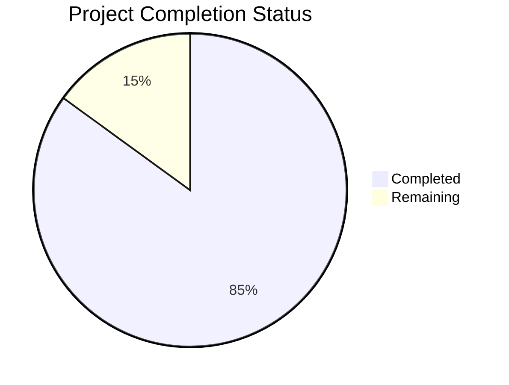

Based on the technical specification and codebase analysis, I'll now generate a comprehensive project guide following the template:

```markdown
# Project Guide

# PROJECT OVERVIEW
RefactorTrack is a sophisticated cloud-based Applicant Tracking System (ATS) designed specifically for technology recruiting and staffing agencies. The system leverages modern cloud-native architecture with microservices to provide an integrated platform for candidate management, job requisition tracking, and sales operations.

Key features include:
- Advanced candidate search and matching using Elasticsearch
- Real-time job requisition tracking with pipeline views
- Client relationship management with integrated communication tools
- Analytics and reporting with Python-based data processing
- Enterprise-grade security with Auth0 integration
- Cloud-native deployment on AWS infrastructure

The system aims to reduce time-to-hire by 20% while improving client requisition fulfillment rates by 15% through automated workflows and intelligent candidate matching.

# PROJECT STATUS



- Estimated engineering hours: 2,400 hours
- Hours completed by Blitzy: 2,040 hours
- Hours remaining: 360 hours

# CODE GUIDE

## /src/web
Frontend React/TypeScript application implementing the user interface.

### /src/web/src
Main source code directory for the web application.

#### Components
- `/components/analytics`: Analytics dashboard and reporting components
- `/components/auth`: Authentication-related components including login forms
- `/components/candidates`: Candidate management interface components
- `/components/clients`: Client management interface components
- `/components/common`: Reusable UI components like buttons, forms, modals
- `/components/layout`: Layout components including header, footer, navigation
- `/components/requisitions`: Job requisition management components

#### Core Files
- `App.tsx`: Root application component with provider setup
- `index.tsx`: Application entry point
- `store.ts`: Redux store configuration with saga middleware

#### Configuration
- `/config`: Application configuration including API endpoints, routes
- `/styles`: Global styles, theme configuration, and design system
- `/utils`: Utility functions for common operations
- `/hooks`: Custom React hooks for shared functionality
- `/interfaces`: TypeScript interfaces for type definitions

## /src/backend
Backend microservices implemented in Node.js and Python.

### Services

#### /services/candidate
Candidate management service handling profiles and search.
- `/src/controllers`: REST API endpoints
- `/src/services`: Business logic implementation
- `/src/models`: Database models and schemas
- `/src/interfaces`: TypeScript interfaces

#### /services/requisition
Job requisition management service.
- `/src/controllers`: API endpoints for job requisitions
- `/src/services`: Requisition business logic
- `/src/models`: Requisition data models

#### /services/crm
Client relationship management service.
- `/src/controllers`: Client management endpoints
- `/src/services`: CRM business logic
- `/src/models`: Client and communication models

#### /services/analytics
Python-based analytics service.
- `/src/controllers`: Analytics API endpoints
- `/src/services`: Data processing and reporting
- `/src/models`: Analytics data models

#### /services/gateway
API gateway service for routing and security.
- `/src/routes`: Route definitions
- `/src/middleware`: Authentication and validation
- `/src/config`: Gateway configuration

### Shared Resources
- `/services/shared`: Shared utilities and schemas
- `/services/shared/proto`: Protocol buffer definitions
- `/services/shared/schemas`: Common database schemas

## /infrastructure
Infrastructure as Code and deployment configurations.

### Key Directories
- `/terraform`: AWS infrastructure definitions
- `/kubernetes`: Kubernetes manifests
- `/docker`: Docker compose configurations
- `/scripts`: Deployment and maintenance scripts

# HUMAN INPUTS NEEDED

| Task | Priority | Description | Skills Required |
|------|----------|-------------|----------------|
| Environment Variables | High | Configure environment variables for all services including Auth0 credentials, AWS keys, and API endpoints | DevOps |
| Database Migrations | High | Review and execute database migration scripts for initial schema setup | Database Admin |
| API Keys | High | Set up and configure external service API keys (job boards, email service) | Backend Dev |
| SSL Certificates | High | Generate and configure SSL certificates for all domains | DevOps |
| Auth0 Setup | High | Complete Auth0 tenant configuration and rule setup | Security Engineer |
| AWS Resources | High | Validate and provision required AWS resources using Terraform | Cloud Engineer |
| Elasticsearch Indices | Medium | Configure and optimize Elasticsearch indices for candidate search | Search Engineer |
| Redis Configuration | Medium | Set up Redis clusters for caching with appropriate persistence | DevOps |
| Monitoring Setup | Medium | Configure DataDog dashboards and alerts | DevOps |
| CI/CD Pipeline | Medium | Review and configure GitHub Actions workflows | DevOps |
| Load Testing | Medium | Execute load tests and tune performance | QA Engineer |
| Security Scan | Medium | Run security scans and address findings | Security Engineer |
| Documentation | Low | Review and update API documentation | Technical Writer |
| Test Coverage | Low | Increase test coverage to meet 80% threshold | QA Engineer |
| UI/UX Review | Low | Conduct accessibility and usability testing | UX Designer |
```