# Technical Specifications

# 1. INTRODUCTION

## 1.1 EXECUTIVE SUMMARY

RefactorTrack is a cloud-based Applicant Tracking System (ATS) designed specifically for technology recruiting and staffing agencies. The system addresses critical inefficiencies in current recruitment workflows by providing an integrated platform for candidate management, job requisition tracking, and sales operations. Primary stakeholders include technical recruiters, sales representatives, and agency management teams who will benefit from streamlined processes, improved collaboration, and data-driven decision making.

The solution aims to reduce time-to-hire by 20% while improving client requisition fulfillment rates by 15% through automated workflows, intelligent candidate matching, and integrated communication tools. By bridging the gap between sales and recruiting teams, RefactorTrack enables agencies to scale their operations efficiently while maintaining high-quality placement standards.

## 1.2 SYSTEM OVERVIEW

### Project Context

| Aspect | Description |
|--------|-------------|
| Market Position | Purpose-built ATS for technology staffing sector |
| Current Limitations | Manual processes, fragmented tools, poor visibility |
| Enterprise Integration | Seamless integration with job boards, email systems, and calendar platforms |

### High-Level Description

| Component | Implementation |
|-----------|----------------|
| Architecture | Cloud-native microservices architecture |
| Infrastructure | AWS/Azure/GCP with multi-region deployment |
| Data Storage | PostgreSQL for structured data, MongoDB for documents |
| Search Capability | Elasticsearch for advanced candidate matching |
| Security | Role-based access control, GDPR-compliant data handling |

### Success Criteria

| Metric | Target |
|--------|--------|
| System Uptime | 99.9% |
| User Adoption | 90% within 3 months |
| Time-to-Hire | 20% reduction |
| Client Satisfaction | 15% improvement |
| Data Processing | < 30 seconds for resume parsing |

## 1.3 SCOPE

### In-Scope Elements

| Category | Components |
|----------|------------|
| Core Features | - Candidate database management<br>- Job requisition tracking<br>- Client relationship management<br>- Analytics and reporting<br>- Integration capabilities |
| User Groups | - Technical recruiters<br>- Sales representatives<br>- System administrators<br>- Agency management |
| Geographic Coverage | - North America (initial release)<br>- English language support |
| Data Domains | - Candidate profiles<br>- Job requisitions<br>- Client information<br>- Communication logs<br>- Performance metrics |

### Out-of-Scope Elements

| Category | Exclusions |
|----------|------------|
| Features | - Payroll processing<br>- Billing/invoicing<br>- Background checks<br>- Video interviewing |
| Integrations | - Legacy HRIS systems<br>- Accounting software<br>- Time tracking tools |
| Languages | - Non-English localization |
| Use Cases | - Direct hire corporate recruiting<br>- Temporary staffing for non-tech roles<br>- Contractor management |

# 2. SYSTEM ARCHITECTURE

## 2.1 High-Level Architecture

RefactorTrack employs a microservices architecture deployed on cloud infrastructure, designed for scalability, resilience, and maintainability.

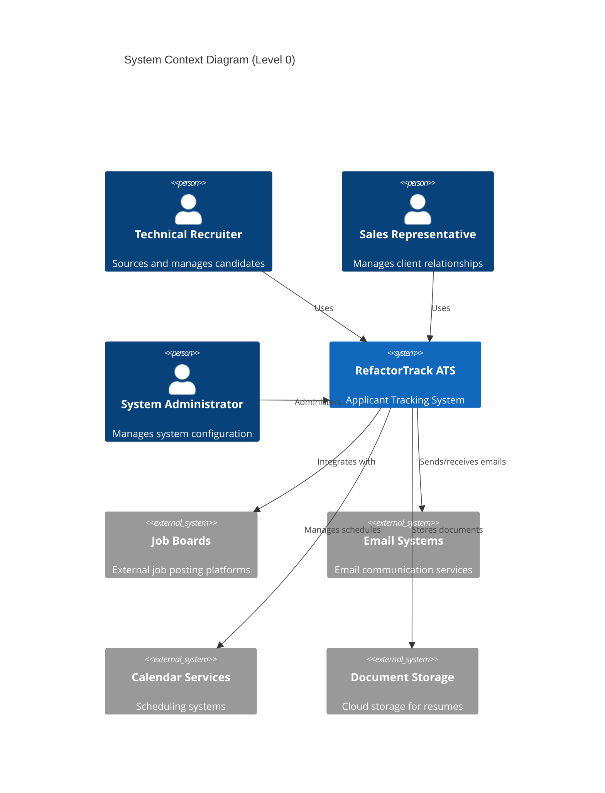

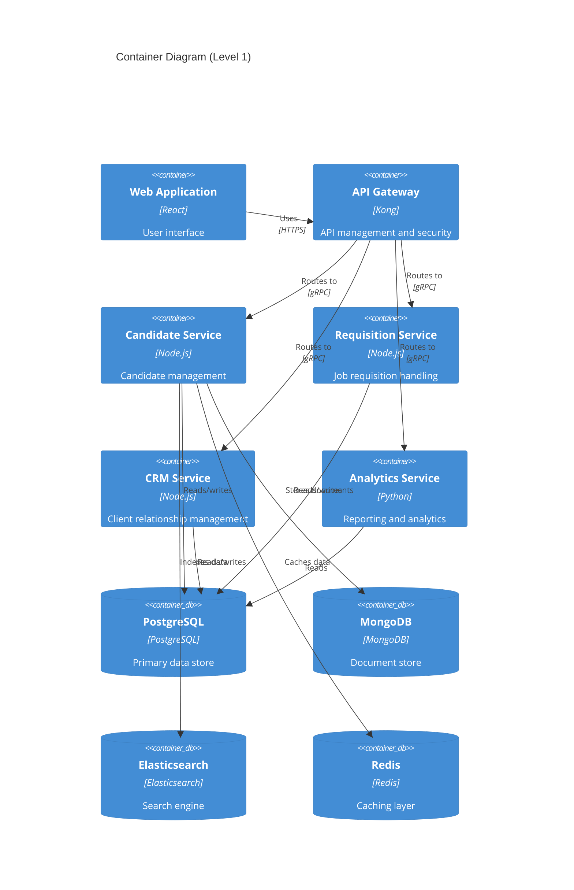

## 2.2 Component Details

### Core Services

| Service | Purpose | Technology Stack | Scaling Strategy |
|---------|---------|-----------------|------------------|
| Candidate Service | Manages candidate profiles and processing | Node.js, Express | Horizontal scaling with load balancer |
| Requisition Service | Handles job requisitions and matching | Node.js, Express | Horizontal scaling with load balancer |
| CRM Service | Manages client relationships and sales pipeline | Node.js, Express | Horizontal scaling with load balancer |
| Analytics Service | Generates reports and analytics | Python, FastAPI | Vertical scaling for compute-intensive tasks |

### Data Storage

| Component | Technology | Purpose | Scaling Strategy |
|-----------|------------|---------|------------------|
| Primary Database | PostgreSQL | Structured data storage | Master-slave replication |
| Document Store | MongoDB | Resume and document storage | Sharding |
| Search Engine | Elasticsearch | Full-text search and matching | Cluster with multiple nodes |
| Cache Layer | Redis | Performance optimization | Redis Cluster |

## 2.3 Technical Decisions

### Architecture Style
- Microservices architecture chosen for:
  - Independent scaling of components
  - Technology flexibility per service
  - Isolated failure domains
  - Easier maintenance and updates

### Communication Patterns

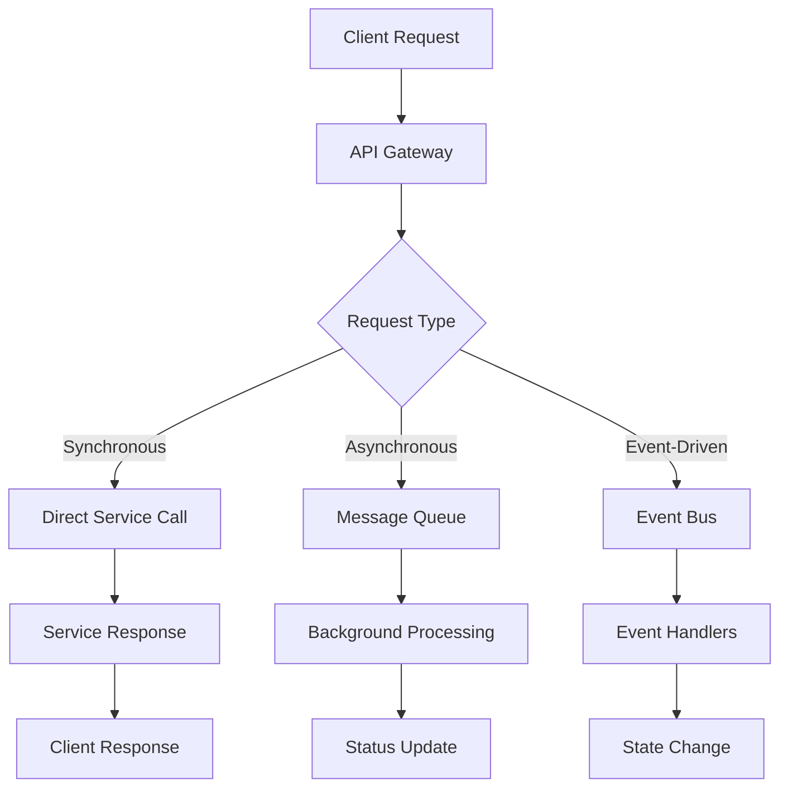

## 2.4 Cross-Cutting Concerns

### Monitoring and Observability

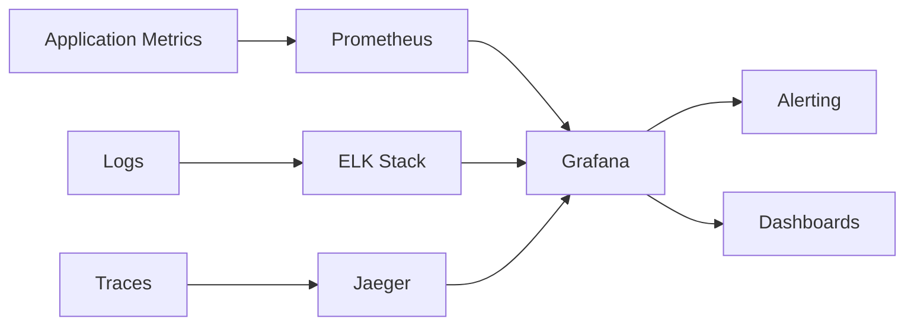

### Security Architecture

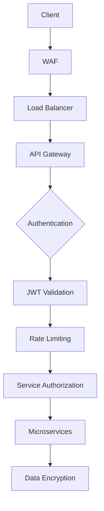

## 2.5 Deployment Architecture

```mermaid
C4Deployment
    title Deployment Diagram
    
    Deployment_Node(cdn, "CDN", "CloudFront"){
        Container(static, "Static Assets", "S3")
    }
    
    Deployment_Node(az1, "Availability Zone 1", "AWS"){
        Container(web1, "Web Servers", "EC2")
        Container(app1, "Application Servers", "ECS")
        Container(db1, "Database Primary", "RDS")
    }
    
    Deployment_Node(az2, "Availability Zone 2", "AWS"){
        Container(web2, "Web Servers", "EC2")
        Container(app2, "Application Servers", "ECS")
        Container(db2, "Database Replica", "RDS")
    }
    
    Rel(cdn, web1, "Routes traffic")
    Rel(cdn, web2, "Routes traffic")
    Rel(web1, app1, "Forwards requests")
    Rel(web2, app2, "Forwards requests")
    Rel(app1, db1, "Reads/writes")
    Rel(app2, db2, "Reads")
    Rel(db1, db2, "Replicates")
```

# 3. SYSTEM COMPONENTS ARCHITECTURE

## 3.1 USER INTERFACE DESIGN

### 3.1.1 Design Specifications

| Component | Specification | Details |
|-----------|--------------|---------|
| Visual Hierarchy | Material Design 3.0 | - 8px grid system<br>- Z-axis layering<br>- Elevation shadows |
| Design System | RefactorTrack UI Kit | - Atomic design principles<br>- Reusable components<br>- Consistent spacing |
| Responsive Design | Mobile-first approach | - Breakpoints: 320px, 768px, 1024px, 1440px<br>- Fluid typography<br>- Flexible grids |
| Accessibility | WCAG 2.1 Level AA | - Minimum contrast ratio 4.5:1<br>- Keyboard navigation<br>- Screen reader support |
| Browser Support | Modern browsers | - Chrome 90+<br>- Firefox 88+<br>- Safari 14+<br>- Edge 90+ |
| Theme Support | Dark/Light modes | - System preference detection<br>- Manual override option<br>- Persistent preference storage |

### 3.1.2 Interface Elements

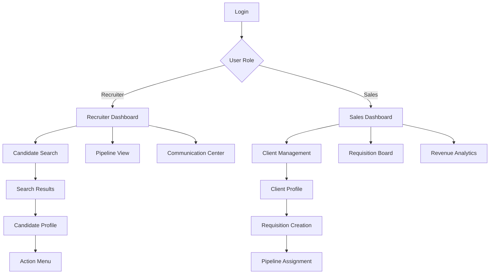

### 3.1.3 Critical User Flows

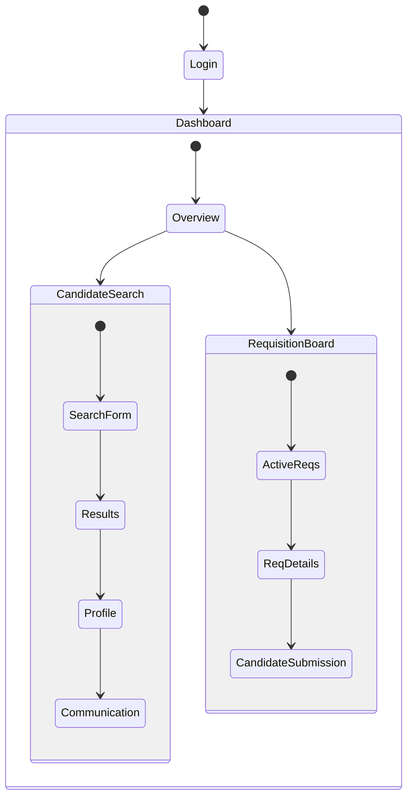

## 3.2 DATABASE DESIGN

### 3.2.1 Schema Design

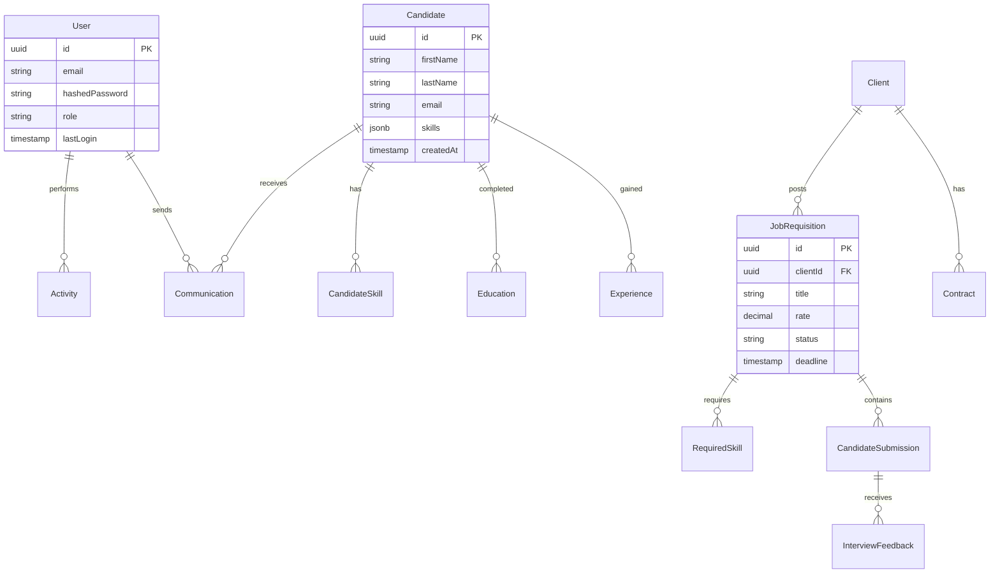

### 3.2.2 Data Management Strategy

| Aspect | Strategy | Implementation |
|--------|----------|----------------|
| Partitioning | Time-based | - Monthly partitions for activity logs<br>- Quarterly partitions for communications |
| Indexing | Selective indexing | - B-tree indexes for lookups<br>- GiST indexes for full-text search |
| Caching | Multi-level | - Redis L1 cache (15min TTL)<br>- PostgreSQL materialized views |
| Archival | Policy-based | - 2-year retention for active data<br>- 5-year cold storage retention |
| Backup | Incremental | - Daily incrementals<br>- Weekly full backups<br>- Cross-region replication |

## 3.3 API DESIGN

### 3.3.1 API Architecture

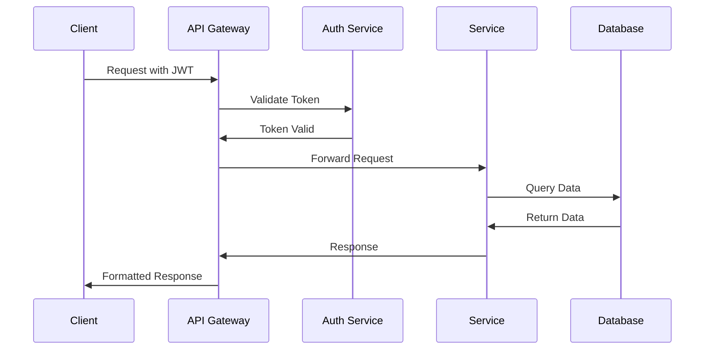

### 3.3.2 Interface Specifications

| Endpoint Category | Base Path | Authentication |
|------------------|-----------|----------------|
| Candidate API | /api/v1/candidates | JWT Bearer |
| Requisition API | /api/v1/requisitions | JWT Bearer |
| Client API | /api/v1/clients | JWT Bearer |
| Analytics API | /api/v1/analytics | JWT Bearer |

### 3.3.3 Integration Patterns

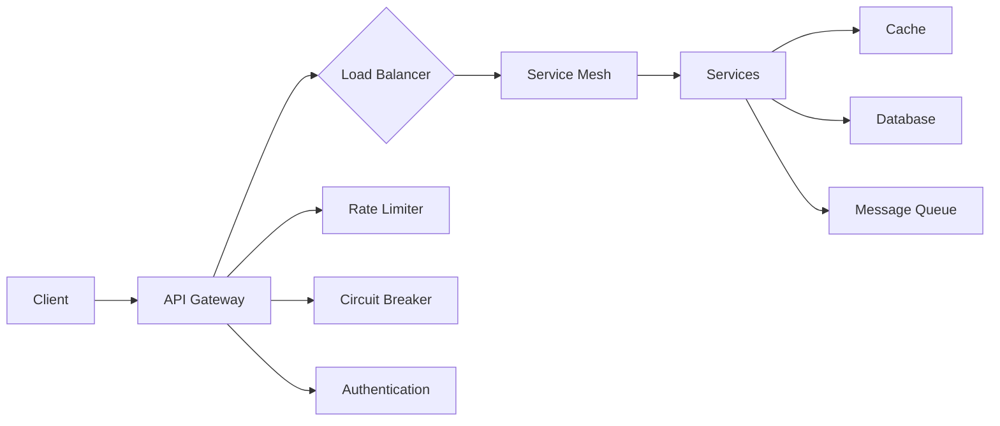

### 3.3.4 API Security Controls

| Control | Implementation | Details |
|---------|----------------|---------|
| Authentication | OAuth 2.0 + JWT | - Token-based authentication<br>- 1-hour token expiry<br>- Refresh token rotation |
| Authorization | RBAC | - Role-based permissions<br>- Resource-level access control<br>- Audit logging |
| Rate Limiting | Token bucket | - 1000 requests/minute per client<br>- Burst allowance: 100<br>- Custom limits per endpoint |
| Input Validation | JSON Schema | - Request payload validation<br>- Type checking<br>- Size limits |
| Security Headers | OWASP Standards | - CORS policies<br>- CSP headers<br>- HSTS enforcement |

# 4. TECHNOLOGY STACK

## 4.1 PROGRAMMING LANGUAGES

| Platform/Component | Language | Version | Justification |
|-------------------|----------|---------|---------------|
| Backend Services | Node.js | 18 LTS | - Excellent async I/O performance<br>- Rich ecosystem for recruitment tools<br>- Strong TypeScript support |
| Analytics Service | Python | 3.11+ | - Superior data processing capabilities<br>- Extensive ML libraries for matching<br>- Efficient ETL processing |
| Frontend Web | TypeScript | 5.0+ | - Type safety for large application<br>- Enhanced developer productivity<br>- Better maintainability |
| Mobile Apps | React Native | TypeScript 5.0+ | - Code sharing with web platform<br>- Native performance<br>- Unified development team |

## 4.2 FRAMEWORKS & LIBRARIES

### Backend Frameworks

| Framework | Version | Purpose | Justification |
|-----------|---------|---------|---------------|
| Express.js | 4.18+ | API Services | - Mature ecosystem<br>- Excellent middleware support<br>- High performance |
| FastAPI | 0.100+ | Analytics Service | - AsyncIO support<br>- Auto-generated OpenAPI docs<br>- High performance |
| gRPC | 1.50+ | Service Communication | - Efficient binary protocol<br>- Strong typing<br>- Bi-directional streaming |

### Frontend Frameworks

| Framework | Version | Purpose | Justification |
|-----------|---------|---------|---------------|
| React | 18+ | Web UI | - Component reusability<br>- Virtual DOM performance<br>- Large ecosystem |
| Material UI | 5+ | UI Components | - Enterprise-ready components<br>- Accessibility support<br>- Customizable theming |
| Redux Toolkit | 1.9+ | State Management | - Predictable state updates<br>- DevTools integration<br>- TypeScript support |

## 4.3 DATABASES & STORAGE

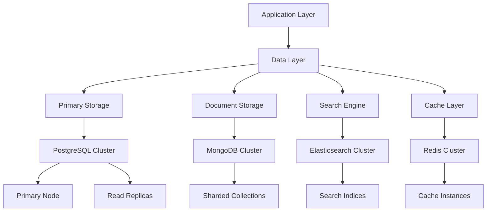

| Component | Technology | Version | Purpose |
|-----------|------------|---------|----------|
| Primary Database | PostgreSQL | 15+ | - Structured data storage<br>- ACID compliance<br>- Complex queries |
| Document Store | MongoDB | 6.0+ | - Resume storage<br>- Flexible schema<br>- Horizontal scaling |
| Search Engine | Elasticsearch | 8.0+ | - Full-text search<br>- Candidate matching<br>- Analytics |
| Cache Layer | Redis | 7.0+ | - Session management<br>- API caching<br>- Real-time data |

## 4.4 THIRD-PARTY SERVICES

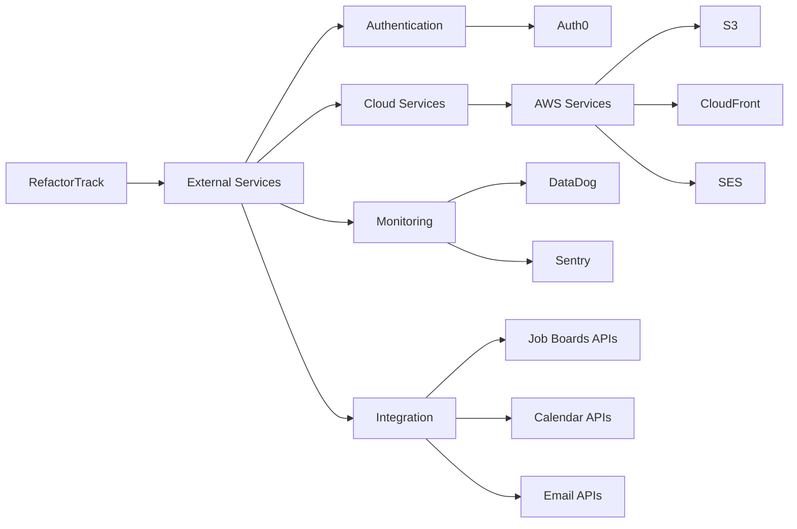

| Service Category | Provider | Purpose |
|-----------------|----------|----------|
| Authentication | Auth0 | - Identity management<br>- SSO support<br>- MFA implementation |
| Cloud Platform | AWS | - Infrastructure hosting<br>- Storage services<br>- Email delivery |
| Monitoring | DataDog | - Application monitoring<br>- Log aggregation<br>- Performance metrics |
| Error Tracking | Sentry | - Error reporting<br>- Performance monitoring<br>- Issue tracking |

## 4.5 DEVELOPMENT & DEPLOYMENT

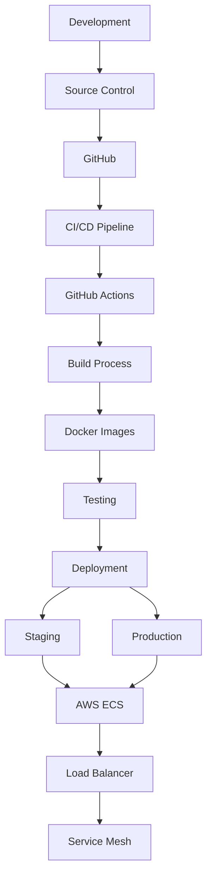

| Category | Tools | Purpose |
|----------|-------|---------|
| Version Control | Git, GitHub | - Code collaboration<br>- Review process<br>- Asset management |
| CI/CD | GitHub Actions | - Automated testing<br>- Deployment automation<br>- Environment management |
| Containerization | Docker | - Application packaging<br>- Dependency management<br>- Environment consistency |
| Orchestration | AWS ECS | - Container orchestration<br>- Service scaling<br>- Load balancing |
| Infrastructure | Terraform | - Infrastructure as code<br>- Environment parity<br>- Resource management |

# 5. SYSTEM DESIGN

## 5.1 USER INTERFACE DESIGN

### 5.1.1 Layout Structure

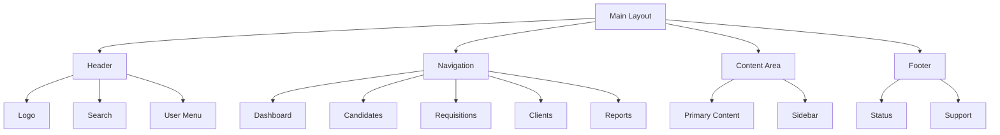

### 5.1.2 Key Interface Components

| Component | Description | Functionality |
|-----------|-------------|---------------|
| Global Search | Persistent top bar | - Full-text search across all entities<br>- Type-ahead suggestions<br>- Advanced filters |
| Navigation Menu | Left sidebar | - Role-based menu items<br>- Collapsible sections<br>- Visual indicators for notifications |
| Dashboard Widgets | Customizable grid | - Drag-and-drop arrangement<br>- Real-time updates<br>- Interactive charts |
| Action Panel | Context-sensitive toolbar | - Common actions for current view<br>- Bulk operations<br>- Export options |

### 5.1.3 Responsive Breakpoints

| Breakpoint | Screen Width | Layout Adjustments |
|------------|--------------|-------------------|
| Mobile | < 768px | - Single column layout<br>- Collapsed navigation<br>- Simplified widgets |
| Tablet | 768px - 1024px | - Two column layout<br>- Expandable navigation<br>- Compact widgets |
| Desktop | > 1024px | - Multi-column layout<br>- Persistent navigation<br>- Full-featured widgets |

## 5.2 DATABASE DESIGN

### 5.2.1 Schema Overview

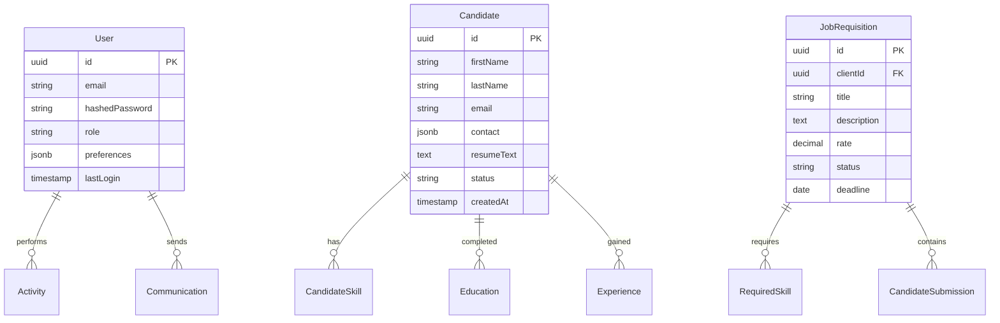

### 5.2.2 Data Storage Strategy

| Data Type | Storage Solution | Justification |
|-----------|-----------------|---------------|
| Structured Data | PostgreSQL | - ACID compliance<br>- Complex query support<br>- Referential integrity |
| Documents | MongoDB | - Flexible schema<br>- Binary storage<br>- Horizontal scaling |
| Search Indices | Elasticsearch | - Full-text search<br>- Fuzzy matching<br>- Analytics support |
| Cache | Redis | - High performance<br>- Data structures<br>- Pub/sub support |

## 5.3 API DESIGN

### 5.3.1 API Architecture

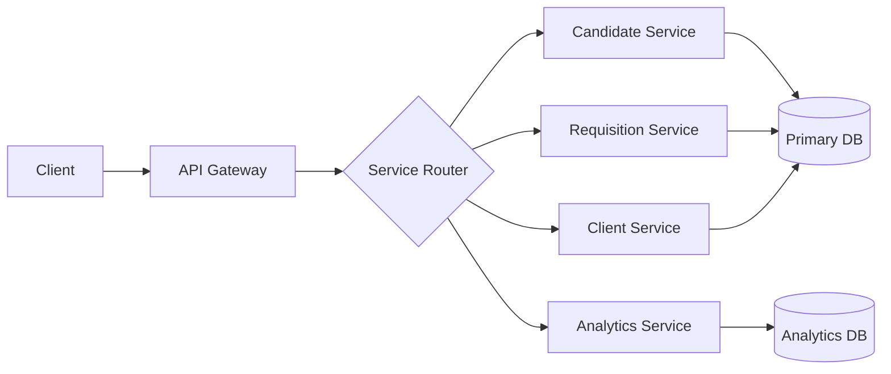

### 5.3.2 API Endpoints

| Service | Endpoint | Methods | Purpose |
|---------|----------|---------|----------|
| Candidates | /api/v1/candidates | GET, POST, PUT, DELETE | Candidate CRUD operations |
| Requisitions | /api/v1/requisitions | GET, POST, PUT, DELETE | Job requisition management |
| Clients | /api/v1/clients | GET, POST, PUT, DELETE | Client relationship management |
| Analytics | /api/v1/analytics | GET | Reporting and metrics |

### 5.3.3 Authentication Flow

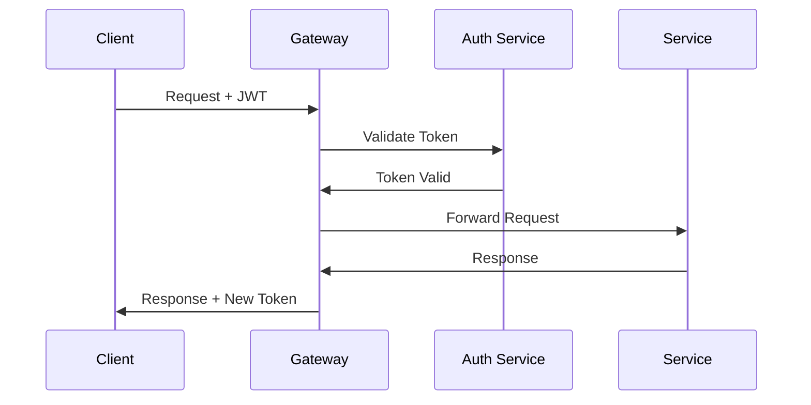

### 5.3.4 API Security Controls

| Control | Implementation | Details |
|---------|----------------|---------|
| Authentication | JWT | - 1-hour token expiry<br>- Refresh token rotation<br>- Secure cookie storage |
| Authorization | RBAC | - Role-based permissions<br>- Resource-level access<br>- Audit logging |
| Rate Limiting | Token bucket | - 1000 requests/minute<br>- Burst allowance<br>- Per-client limits |
| Input Validation | JSON Schema | - Request validation<br>- Type checking<br>- Size limits |

# 6. USER INTERFACE DESIGN

## 6.1 Design System

The RefactorTrack UI follows Material Design 3.0 principles with a custom design system optimized for recruiting workflows.

### Component Key
```
Icons:
[?] - Help/Documentation
[$] - Financial/Billing
[i] - Information
[+] - Add New/Create
[x] - Close/Delete
[<] [>] - Navigation
[^] - Upload
[#] - Dashboard
[@] - User Profile
[!] - Alerts/Warnings
[=] - Settings Menu
[*] - Favorite/Important

Interactive Elements:
[ ] - Checkbox
( ) - Radio Button
[Button] - Clickable Button
[...] - Text Input Field
[====] - Progress Bar
[v] - Dropdown Menu
```

## 6.2 Main Dashboard

```
+----------------------------------------------------------+
|  RefactorTrack             [@]Account  [?]Help  [=]Menu   |
+----------------------------------------------------------+
|  [#]Dashboard  [*]Candidates  [$]Requisitions  [i]Reports |
+----------------------------------------------------------+
|                                                           |
|  Active Requisitions [====] 75%                           |
|  +------------------+  +------------------+               |
|  | Open Positions   |  | Candidate Pool   |               |
|  | 42 Active        |  | 1,250 Active     |               |
|  | [>] View All     |  | [>] Search       |               |
|  +------------------+  +------------------+               |
|                                                           |
|  Recent Activity                        [v]Filter         |
|  +------------------------------------------------+      |
|  | [!] New submission for Senior Developer         |      |
|  | [@] John Smith updated Java Developer profile   |      |
|  | [$] New requisition from TechCorp              |      |
|  | [*] Candidate shortlist updated                 |      |
|  +------------------------------------------------+      |
|                                                           |
|  Quick Actions:                                          |
|  [+]Add Candidate  [^]Import Resumes  [Button]Reports    |
+----------------------------------------------------------+
```

## 6.3 Candidate Search Interface

```
+----------------------------------------------------------+
|  Candidate Search                          [@]User  [=]    |
+----------------------------------------------------------+
|  Search: [...........................] [Button]Search      |
|                                                           |
|  Filters:                          Results: 150 found     |
|  +-------------------+  +---------------------------+     |
|  | Skills:           |  | Jane Doe                  |     |
|  | [x] Java          |  | Senior Developer          |     |
|  | [x] Python        |  | [*]Matched 8/10 skills    |     |
|  | [ ] JavaScript    |  | [>] View Profile          |     |
|  |                   |  +---------------------------+     |
|  | Experience:       |  | John Smith                |     |
|  | ( ) 0-2 years    |  | Full Stack Engineer       |     |
|  | (x) 3-5 years    |  | [*]Matched 7/10 skills    |     |
|  | ( ) 5+ years     |  | [>] View Profile          |     |
|  |                   |  +---------------------------+     |
|  | Location: [v]     |                                   |
|  | Rate: [$][...]    |  [Button]Load More                |
|  +-------------------+                                    |
+----------------------------------------------------------+
```

## 6.4 Candidate Profile View

```
+----------------------------------------------------------+
|  Candidate Profile                                        |
+----------------------------------------------------------+
|  +----------------------+  +-------------------------+     |
|  | [@] John Smith       |  | Status: [v]Available    |     |
|  | Senior Developer     |  | Rating: [*][*][*][*][ ] |     |
|  | [^]Update Resume     |  | Last Contact: 2d ago    |     |
|  +----------------------+  +-------------------------+     |
|                                                           |
|  Skills & Experience                                      |
|  +--------------------------------------------------+   |
|  | Technical Skills:    | Experience:                |   |
|  | - Java (8 years)    | Current: Tech Corp         |   |
|  | - Spring (5 years)  | Previous: Dev Inc          |   |
|  | - AWS (3 years)     | Duration: 10 years         |   |
|  +--------------------------------------------------+   |
|                                                           |
|  Matching Requisitions                                    |
|  +--------------------------------------------------+   |
|  | [*] Senior Java Developer at ClientCo             |   |
|  | [*] Technical Lead at TechFirm                   |   |
|  | [Button]Submit to Position                        |   |
|  +--------------------------------------------------+   |
|                                                           |
|  Communication History                                    |
|  +--------------------------------------------------+   |
|  | [@] Phone Screen - 2023-10-15                    |   |
|  | [@] Email Follow-up - 2023-10-12                 |   |
|  | [+]Add Communication                             |   |
|  +--------------------------------------------------+   |
+----------------------------------------------------------+
```

## 6.5 Requisition Board

```
+----------------------------------------------------------+
|  Requisition Board                     [+]New Requisition  |
+----------------------------------------------------------+
|  View: (x)Pipeline  ( )List  ( )Calendar                  |
|                                                           |
|  +-------------+  +-------------+  +-------------+        |
|  | New         |  | In Progress |  | Submitted   |        |
|  | (5)         |  | (12)        |  | (8)         |        |
|  +-------------+  +-------------+  +-------------+        |
|  | [$]Java Dev  |  | [$]Sr. Eng  |  | [$]DevOps   |        |
|  | TechCorp    |  | ClientCo    |  | StartupInc  |        |
|  | Due: 7d     |  | Due: 15d    |  | Due: 3d     |        |
|  | [!]Urgent   |  | [====]60%   |  | [====]90%   |        |
|  +-------------+  +-------------+  +-------------+        |
|  | [$]PM Role   |  | [$]QA Lead  |  | [$]Architect|        |
|  | DevFirm     |  | TechInc     |  | CorpTech   |        |
|  | Due: 30d    |  | Due: 10d    |  | Due: 5d     |        |
|  | [====]20%   |  | [====]75%   |  | [====]95%   |        |
|  +-------------+  +-------------+  +-------------+        |
|                                                           |
|  [Button]Export  [Button]Filter  [Button]Sort             |
+----------------------------------------------------------+
```

## 6.6 Mobile Responsive Design

```
+----------------------+
| RefactorTrack  [=]  |
+----------------------+
| [@]John Smith       |
| [#]Dashboard        |
+----------------------+
| Quick Stats         |
| Active: 42          |
| Pending: 15         |
| [>]View All         |
+----------------------+
| Recent Activity     |
| [!]New submission   |
| [!]Updated profile  |
| [>]View All         |
+----------------------+
| Actions:            |
| [+]Add Candidate    |
| [^]Upload Resume    |
| [$]View Pipeline    |
+----------------------+
| [Button]Refresh     |
+----------------------+
```

## 6.7 Interaction Patterns

### Navigation Flow
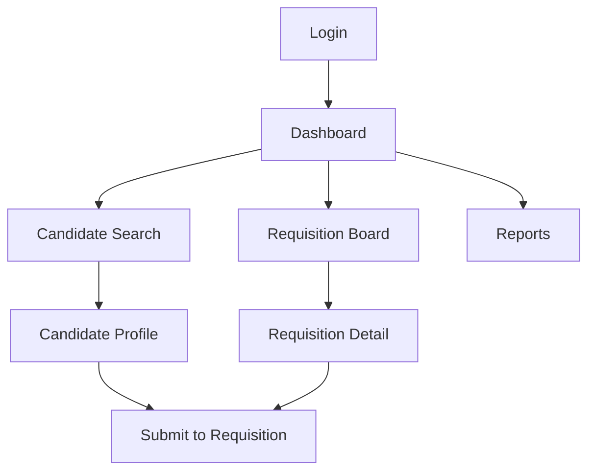

### State Management
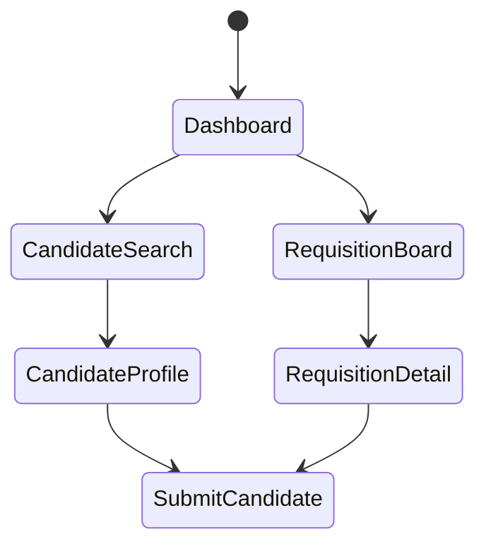

# 7. SECURITY CONSIDERATIONS

## 7.1 AUTHENTICATION AND AUTHORIZATION

### Authentication Flow

```mermaid
sequenceDiagram
    participant U as User
    participant F as Frontend
    participant A as Auth Service
    participant S as System Services
    participant D as Database
    
    U->>F: Login Request
    F->>A: Forward Credentials
    A->>D: Validate Credentials
    D->>A: Credentials Valid
    A->>A: Generate JWT & Refresh Token
    A->>F: Return Tokens
    F->>U: Login Success
    
    U->>F: API Request
    F->>S: Request + JWT
    S->>A: Validate Token
    A->>S: Token Valid
    S->>D: Process Request
    D->>S: Return Data
    S->>F: Response
    F->>U: Display Data
```

### Authorization Matrix

| Role | Candidate Data | Requisitions | Client Data | Analytics | System Config |
|------|---------------|--------------|-------------|-----------|---------------|
| Recruiter | Full Access | Read & Update | Read Only | Limited | None |
| Sales Rep | Limited | Full Access | Full Access | Limited | None |
| Admin | Full Access | Full Access | Full Access | Full Access | Full Access |
| Manager | Read Only | Read Only | Read Only | Full Access | Limited |

### Authentication Implementation

| Component | Implementation | Details |
|-----------|----------------|---------|
| Identity Provider | Auth0 | - OpenID Connect compliant<br>- MFA support<br>- Social login integration |
| Token Management | JWT | - 1-hour access token expiry<br>- 7-day refresh token<br>- Rotation policy |
| Password Policy | Custom | - 12 character minimum<br>- Complexity requirements<br>- Password history |
| Session Management | Redis | - Distributed session storage<br>- 30-minute idle timeout<br>- Force logout capability |

## 7.2 DATA SECURITY

### Data Classification

| Classification | Examples | Security Controls |
|----------------|----------|------------------|
| Highly Sensitive | - SSN/Tax IDs<br>- Financial Data | - Field-level encryption<br>- Strict access controls<br>- Audit logging |
| Sensitive | - Contact Details<br>- Salary Info | - Data masking<br>- Role-based access<br>- Usage logging |
| Internal | - Job Descriptions<br>- Company Info | - Standard access controls<br>- Basic logging |
| Public | - Job Titles<br>- Office Locations | - No special controls |

### Encryption Implementation

```mermaid
flowchart TD
    A[Data Entry] --> B{Data Classification}
    B -->|Highly Sensitive| C[Field Encryption]
    B -->|Sensitive| D[Data Masking]
    B -->|Internal| E[Standard Storage]
    
    C --> F[AWS KMS]
    F --> G[AES-256 Encryption]
    G --> H[Encrypted Storage]
    
    D --> I[Masking Rules]
    I --> J[Masked Storage]
    
    E --> K[Regular Storage]
    
    H & J & K --> L[Access Control]
    L --> M[Audit Logging]
```

### Data Protection Measures

| Protection Layer | Implementation | Purpose |
|-----------------|----------------|----------|
| Transport | TLS 1.3 | Secure data in transit |
| Storage | AES-256 | Encrypt data at rest |
| Application | Field-level encryption | Protect sensitive fields |
| Database | Transparent Data Encryption | Protect database files |
| Backup | Encrypted backups | Secure stored backups |

## 7.3 SECURITY PROTOCOLS

### Security Architecture

```mermaid
flowchart LR
    A[Client] --> B[WAF]
    B --> C[Load Balancer]
    C --> D[API Gateway]
    
    D --> E{Security Controls}
    E --> F[Rate Limiting]
    E --> G[Input Validation]
    E --> H[Token Validation]
    
    F & G & H --> I[Application Layer]
    I --> J[Database Layer]
    
    K[Security Monitoring] --> B & C & D & I & J
    L[Threat Detection] --> B & C & D & I & J
```

### Security Controls

| Control Type | Implementation | Details |
|-------------|----------------|----------|
| WAF | AWS WAF | - OWASP Top 10 protection<br>- Custom rule sets<br>- IP reputation filtering |
| DDoS Protection | CloudFlare | - Layer 3/4 protection<br>- Layer 7 protection<br>- Rate limiting |
| Vulnerability Scanning | Qualys | - Weekly scans<br>- Automated remediation<br>- Compliance reporting |
| Intrusion Detection | AWS GuardDuty | - Threat detection<br>- Behavioral monitoring<br>- Automated response |

### Security Compliance

| Standard | Requirements | Implementation |
|----------|--------------|----------------|
| GDPR | Data Protection | - Consent management<br>- Data portability<br>- Right to be forgotten |
| SOC 2 | Security Controls | - Access controls<br>- Encryption<br>- Monitoring |
| CCPA | Privacy Rights | - Data disclosure<br>- Opt-out mechanisms<br>- Data deletion |
| ISO 27001 | Security Management | - Risk assessment<br>- Security policies<br>- Incident response |

### Security Monitoring

| Aspect | Tool | Purpose |
|--------|------|---------|
| Log Management | ELK Stack | - Centralized logging<br>- Log analysis<br>- Alert generation |
| Security Events | Splunk | - SIEM functionality<br>- Threat detection<br>- Incident response |
| Performance Monitoring | DataDog | - Security metrics<br>- Anomaly detection<br>- Resource monitoring |
| Audit Trails | Custom Solution | - Action logging<br>- Change tracking<br>- Compliance reporting |

# 8. INFRASTRUCTURE

## 8.1 DEPLOYMENT ENVIRONMENT

RefactorTrack utilizes a cloud-native deployment model with multi-region availability for high reliability and global accessibility.

### Environment Strategy

| Environment | Purpose | Configuration |
|------------|---------|---------------|
| Development | Feature development and testing | Single region, scaled-down resources |
| Staging | Pre-production testing and validation | Multi-region, production-like setup |
| Production | Live system serving end users | Multi-region, full redundancy |
| DR | Disaster recovery failover | Secondary region, warm standby |

### Regional Distribution

```mermaid
flowchart TD
    A[Global Load Balancer] --> B[Primary Region]
    A --> C[Secondary Region]
    
    subgraph Primary[Primary Region - US East]
        B --> D[AZ-1]
        B --> E[AZ-2]
        D & E --> F[(Primary DB)]
    end
    
    subgraph Secondary[Secondary Region - US West]
        C --> G[AZ-1]
        C --> H[AZ-2]
        G & H --> I[(Replica DB)]
    end
    
    F -.-> I
```

## 8.2 CLOUD SERVICES

AWS serves as the primary cloud provider, chosen for its extensive service portfolio and global presence.

| Service Category | AWS Service | Purpose | Justification |
|-----------------|-------------|---------|---------------|
| Compute | ECS Fargate | Container hosting | Serverless container management with auto-scaling |
| Database | Aurora PostgreSQL | Primary database | High availability, automatic failover |
| Document Store | DocumentDB | Resume storage | MongoDB-compatible with managed scaling |
| Search | OpenSearch | Search engine | Managed Elasticsearch service with fine-grained access control |
| Cache | ElastiCache | Application cache | Redis-compatible with cluster mode |
| Storage | S3 | Object storage | Highly durable storage for documents and backups |
| CDN | CloudFront | Content delivery | Global edge network for static assets |
| Security | KMS | Key management | Centralized encryption key management |

## 8.3 CONTAINERIZATION

```mermaid
flowchart LR
    A[Source Code] --> B[Docker Build]
    B --> C[Container Registry]
    C --> D[ECS Deployment]
    
    subgraph Container Images
        E[Web UI]
        F[API Services]
        G[Background Workers]
    end
    
    B --> E & F & G
    E & F & G --> C
```

### Container Strategy

| Component | Base Image | Size Optimization | Security Measures |
|-----------|------------|-------------------|-------------------|
| Web UI | node:18-alpine | Multi-stage build | Non-root user, minimal dependencies |
| API Services | node:18-alpine | Multi-stage build | Non-root user, minimal dependencies |
| Background Workers | python:3.11-slim | Multi-stage build | Non-root user, minimal dependencies |
| Analytics Service | python:3.11-slim | Multi-stage build | Non-root user, minimal dependencies |

## 8.4 ORCHESTRATION

AWS ECS with Fargate provides serverless container orchestration.

```mermaid
flowchart TD
    A[ECS Cluster] --> B[Service Discovery]
    A --> C[Task Definitions]
    
    C --> D[Web Tasks]
    C --> E[API Tasks]
    C --> F[Worker Tasks]
    
    D & E & F --> G[Service Mesh]
    G --> H[Load Balancer]
    
    subgraph Auto Scaling
        I[Target Tracking]
        J[Step Scaling]
    end
    
    D & E & F --> I
    D & E & F --> J
```

### Service Configuration

| Service | Min Instances | Max Instances | Scaling Metric |
|---------|--------------|---------------|----------------|
| Web UI | 2 | 10 | CPU Utilization (70%) |
| API Services | 3 | 15 | Request Count |
| Background Workers | 2 | 8 | Queue Length |
| Analytics Service | 1 | 5 | CPU Utilization (80%) |

## 8.5 CI/CD PIPELINE

```mermaid
flowchart LR
    A[GitHub Repository] --> B[GitHub Actions]
    B --> C{Build & Test}
    C -->|Success| D[Container Build]
    C -->|Failure| E[Notify Team]
    
    D --> F[Push to ECR]
    F --> G{Environment}
    
    G -->|Development| H[Dev ECS]
    G -->|Staging| I[Stage ECS]
    G -->|Production| J[Prod ECS]
    
    H & I & J --> K[Post-Deploy Tests]
    K -->|Success| L[Monitor]
    K -->|Failure| M[Rollback]
```

### Pipeline Stages

| Stage | Tools | Actions | Success Criteria |
|-------|-------|---------|------------------|
| Code Analysis | SonarQube | Static code analysis, security scanning | No critical issues |
| Unit Testing | Jest, PyTest | Run automated tests | 100% pass rate |
| Build | Docker | Create container images | Successful build |
| Security Scan | Snyk, Trivy | Container vulnerability scanning | No critical vulnerabilities |
| Deployment | AWS CDK | Infrastructure updates, container deployment | Health check pass |
| Validation | Postman, K6 | Integration tests, performance tests | All tests pass |
| Monitoring | DataDog | Performance metrics, error tracking | No critical alerts |

### Deployment Strategy

| Environment | Strategy | Rollback Time | Approval |
|------------|----------|---------------|----------|
| Development | Direct Push | Automatic | None |
| Staging | Blue/Green | < 5 minutes | Tech Lead |
| Production | Blue/Green | < 5 minutes | Product Owner |

# 8. APPENDICES

## 8.1 ADDITIONAL TECHNICAL INFORMATION

### Development Environment Setup

| Component | Tool/Version | Configuration |
|-----------|-------------|---------------|
| IDE | VS Code 1.80+ | Extensions: ESLint, Prettier, Docker |
| Version Control | Git 2.40+ | Conventional commits, branch protection |
| Package Manager | npm 9.0+ | Yarn 3.0+ alternative supported |
| Build Tools | Webpack 5.0+ | Production optimization enabled |
| Testing Framework | Jest 29.0+ | Coverage threshold: 80% |
| API Testing | Postman 10.0+ | Environment-based configurations |

### Code Quality Standards

```mermaid
flowchart TD
    A[Code Quality Gates] --> B[Static Analysis]
    A --> C[Testing]
    A --> D[Security Scan]
    A --> E[Performance Check]
    
    B --> F[ESLint]
    B --> G[SonarQube]
    
    C --> H[Unit Tests]
    C --> I[Integration Tests]
    C --> J[E2E Tests]
    
    D --> K[SAST]
    D --> L[DAST]
    D --> M[SCA]
    
    E --> N[Lighthouse]
    E --> O[WebPageTest]
```

### Error Handling Strategy

| Error Type | Handling Approach | Recovery Action |
|------------|------------------|-----------------|
| Validation Errors | Client-side validation with backend verification | User notification with correction guidance |
| Network Errors | Retry with exponential backoff | Fallback to cached data if available |
| Database Errors | Transaction rollback | Automatic failover to replica |
| Integration Errors | Circuit breaker pattern | Graceful degradation of features |
| Authentication Errors | Token refresh attempt | Redirect to login with session preservation |

## 8.2 GLOSSARY

| Term | Definition |
|------|------------|
| Blue/Green Deployment | Deployment strategy using two identical environments for zero-downtime updates |
| Circuit Breaker | Design pattern that prevents cascading failures in distributed systems |
| Content Delivery Network (CDN) | Distributed network of servers that delivers content based on user location |
| Eventual Consistency | Database model where replicas may temporarily have different values but converge over time |
| Horizontal Scaling | Adding more machines to handle increased load |
| Idempotency | Property where an operation can be repeated without changing the result |
| Service Mesh | Infrastructure layer that handles service-to-service communication |
| Sharding | Database partitioning that splits data across multiple servers |
| Vertical Scaling | Adding more resources to existing machines |
| Warm Standby | Disaster recovery configuration where backup systems are partially active |

## 8.3 ACRONYMS

| Acronym | Full Form |
|---------|-----------|
| AES | Advanced Encryption Standard |
| CDN | Content Delivery Network |
| CORS | Cross-Origin Resource Sharing |
| CSP | Content Security Policy |
| DAST | Dynamic Application Security Testing |
| DDoS | Distributed Denial of Service |
| E2E | End-to-End |
| ETL | Extract, Transform, Load |
| HSTS | HTTP Strict Transport Security |
| IDE | Integrated Development Environment |
| MFA | Multi-Factor Authentication |
| OWASP | Open Web Application Security Project |
| SAST | Static Application Security Testing |
| SCA | Software Composition Analysis |
| SDK | Software Development Kit |
| SLA | Service Level Agreement |
| SSO | Single Sign-On |
| TTL | Time To Live |
| UI/UX | User Interface/User Experience |
| VPC | Virtual Private Cloud |
| WAF | Web Application Firewall |
| XSS | Cross-Site Scripting |

```mermaid
mindmap
    root(Technical Terms)
        Security
            Authentication
                SSO
                MFA
            Authorization
                RBAC
                JWT
            Protection
                WAF
                DDoS
        Infrastructure
            Cloud
                VPC
                CDN
            Scaling
                Horizontal
                Vertical
        Development
            Testing
                E2E
                SAST
                DAST
            Tools
                IDE
                SDK
        Performance
            Metrics
                SLA
                TTL
            Optimization
                Cache
                CDN
```