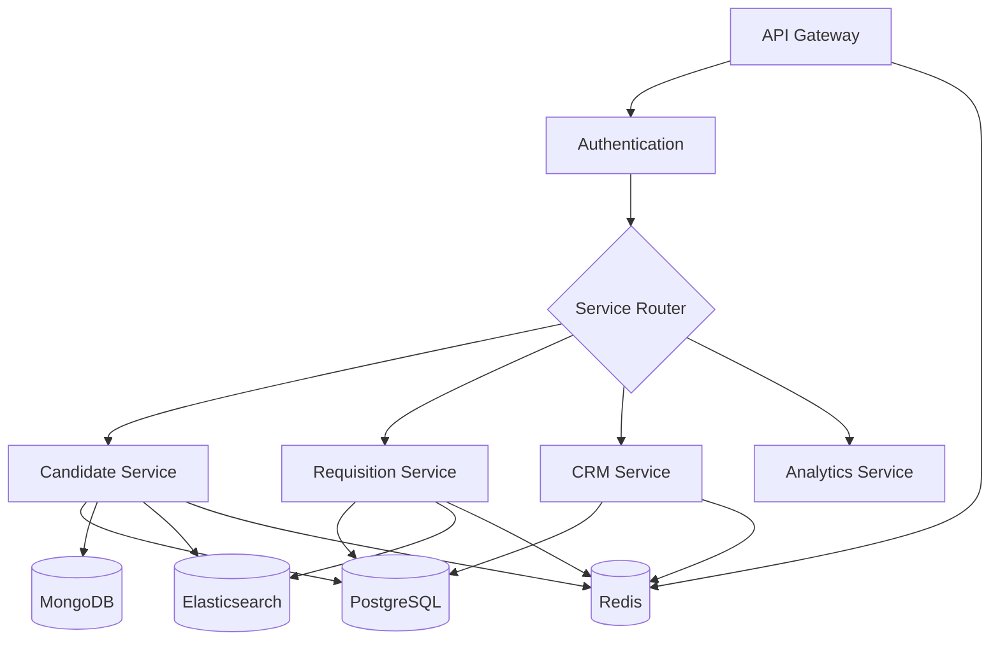

# RefactorTrack Backend

## Overview

RefactorTrack is a cloud-native Applicant Tracking System (ATS) designed specifically for technology recruiting and staffing agencies. This repository contains the backend microservices architecture that powers the RefactorTrack platform.

### Key Features

- 🔄 Microservices Architecture
- 🔐 Enterprise-grade Security
- 📊 Real-time Analytics
- 🚀 Horizontal Scalability
- 🔍 Advanced Search Capabilities
- 🌐 Multi-region Deployment Support

### Technology Stack

- **Runtime**: Node.js (≥18.0.0)
- **Languages**: TypeScript, Python (Analytics Service)
- **Frameworks**: Express.js, FastAPI
- **Databases**: 
  - PostgreSQL (≥15.0) - Primary data store
  - MongoDB (≥6.0) - Document store
  - Elasticsearch (≥8.0) - Search engine
  - Redis (≥7.0) - Caching layer
- **Message Queue**: Redis Pub/Sub
- **Container Runtime**: Docker (≥20.10.0)

## Prerequisites

Ensure you have the following installed:

- Node.js ≥18.0.0
- npm ≥9.0.0
- Docker ≥20.10.0
- Docker Compose ≥2.0.0
- Python ≥3.11.0 (for Analytics Service)
- Git ≥2.40.0

## Project Structure

```
backend/
├── services/
│   ├── candidate-service/     # Candidate management service
│   ├── requisition-service/   # Job requisition service
│   ├── crm-service/          # Client relationship management
│   ├── analytics-service/     # Python-based analytics service
│   └── gateway-service/      # API Gateway service
├── shared/                   # Shared libraries and utilities
├── infrastructure/          # Infrastructure as code
├── scripts/                 # Build and deployment scripts
├── tests/                   # Integration tests
└── docker-compose.yml       # Local development setup
```

## Getting Started

### Installation

```bash
# Clone the repository
git clone https://github.com/org/refactortrack.git

# Navigate to backend directory
cd refactortrack/backend

# Install dependencies
npm install

# Bootstrap services
npm run bootstrap

# Configure environment
cp .env.example .env
```

### Development

```bash
# Start all services in development mode
npm run dev

# Run tests
npm run test

# Lint code
npm run lint

# Format code
npm run format

# Start with Docker Compose
docker-compose up
```

## Architecture

### Service Architecture



### Data Flow Patterns

- **Synchronous Communication**: REST APIs with Circuit Breaker pattern
- **Asynchronous Communication**: Redis Pub/Sub for event-driven updates
- **Caching Strategy**: Redis with write-through caching
- **Search Indexing**: Real-time Elasticsearch indexing

## Configuration

### Environment Variables

Key environment variables (see `.env.example` for complete list):

```bash
# Application
NODE_ENV=development
PORT=3000
API_VERSION=v1

# Database
POSTGRES_HOST=localhost
POSTGRES_PORT=5432
POSTGRES_DB=refactortrack
POSTGRES_USER=admin
POSTGRES_PASSWORD=secret

# Redis
REDIS_HOST=localhost
REDIS_PORT=6379

# Elasticsearch
ELASTICSEARCH_NODE=http://localhost:9200

# JWT
JWT_SECRET=your-secret-key
JWT_EXPIRY=1h
```

## API Documentation

- **Development**: http://localhost:3000/api/docs
- **Staging**: https://api.staging.refactortrack.com/docs
- **Production**: https://api.refactortrack.com/docs

## Testing

```bash
# Run all tests
npm run test

# Run tests with coverage
npm run test:coverage

# Run specific service tests
npm run test --scope=@refactortrack/candidate-service
```

## Deployment

### Production Deployment

```bash
# Build all services
npm run build

# Deploy to staging
npm run deploy:staging

# Deploy to production
npm run deploy:production
```

### Infrastructure

- **Cloud Provider**: AWS
- **Container Orchestration**: ECS Fargate
- **CI/CD**: GitHub Actions
- **Monitoring**: DataDog, Prometheus
- **Logging**: ELK Stack

## Performance Monitoring

- **Metrics Collection**: Prometheus with custom metrics
- **APM**: DataDog APM
- **Logging**: ELK Stack with structured logging
- **Tracing**: OpenTelemetry integration

## Security

- JWT-based authentication
- Role-based access control (RBAC)
- Rate limiting per client
- Input validation and sanitization
- Security headers (Helmet)
- CORS configuration
- Data encryption at rest and in transit

## Troubleshooting

### Common Issues

1. **Database Connection Issues**
   ```bash
   # Check PostgreSQL container
   docker-compose ps
   docker-compose logs postgres
   ```

2. **Service Dependencies**
   ```bash
   # Check service health
   curl http://localhost:3000/health
   
   # View service logs
   docker-compose logs -f service-name
   ```

## Contributing

1. Fork the repository
2. Create your feature branch (`git checkout -b feature/amazing-feature`)
3. Commit your changes (`git commit -m 'Add amazing feature'`)
4. Push to the branch (`git push origin feature/amazing-feature`)
5. Open a Pull Request

## License

Proprietary - All Rights Reserved

## Support

For support, email: support@refactortrack.com

---

Built with ❤️ by the RefactorTrack Team