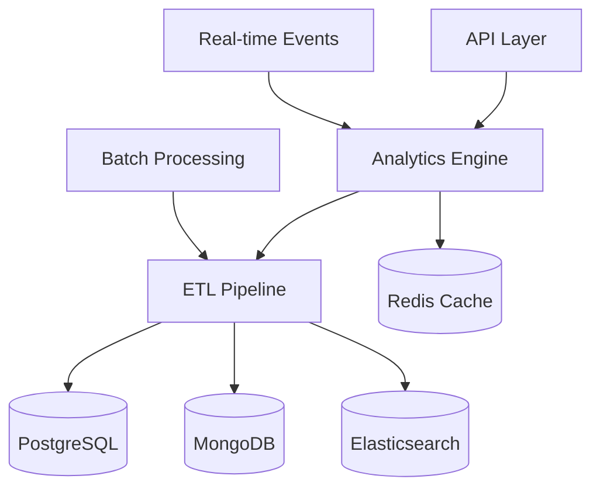
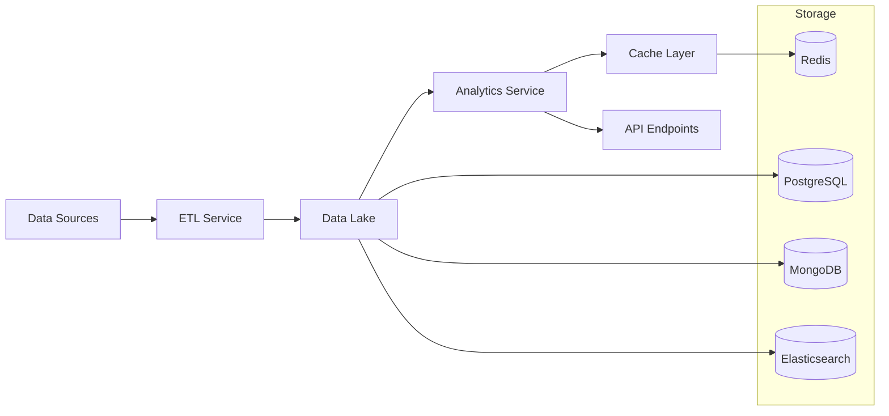
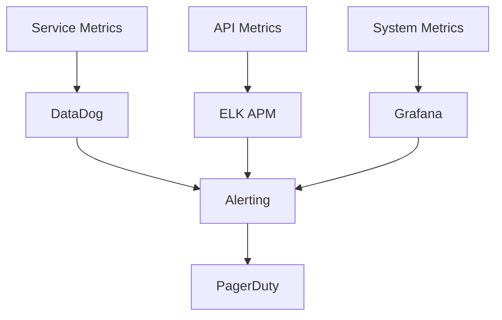

# RefactorTrack Analytics Service

## Overview

The RefactorTrack Analytics Service is a high-performance microservice designed to provide comprehensive analytics and reporting capabilities for technology recruiting and staffing operations. This service processes recruitment data in real-time to deliver actionable insights, performance metrics, and trend analysis.

### Key Features
- Real-time recruitment metrics and KPIs
- Hiring performance analysis
- Skill trend analysis and demand patterns
- Multi-database analytics processing
- High-performance data processing (<30s)
- Scalable architecture supporting 100+ concurrent users

## Architecture

### System Components


### Data Flow Architecture


## Prerequisites

### Runtime Dependencies
- Python ^3.11
- pandas ^2.0.0
- numpy ^1.24.0
- asyncio ^3.9.0

### Infrastructure Dependencies
- PostgreSQL 15+
- MongoDB 6.0+
- Elasticsearch 8.0+
- Redis 7.0+

## Installation

1. Clone the repository:
```bash
git clone <repository-url>
cd src/backend/services/analytics
```

2. Create and activate virtual environment:
```bash
python -m venv venv
source venv/bin/activate  # Linux/Mac
.\venv\Scripts\activate   # Windows
```

3. Install dependencies:
```bash
pip install -r requirements.txt
```

4. Configure environment variables:
```bash
cp .env.example .env
# Edit .env with your configuration
```

## Configuration

### Environment Variables

| Variable | Description | Required |
|----------|-------------|----------|
| POSTGRES_URI | PostgreSQL connection string | Yes |
| MONGODB_URI | MongoDB connection string | Yes |
| ELASTICSEARCH_URI | Elasticsearch connection string | Yes |
| REDIS_URI | Redis connection string | Yes |

### Performance Tuning

| Parameter | Default | Description |
|-----------|---------|-------------|
| BATCH_SIZE | 1000 | ETL batch processing size |
| CACHE_TTL | 300 | Cache TTL in seconds |
| MAX_WORKERS | 4 | Maximum worker threads |
| QUEUE_SIZE | 10000 | Event queue size |

## API Documentation

### Metrics API
```http
GET /api/v1/analytics/metrics
```

Query Parameters:
- `start_date` (ISO 8601)
- `end_date` (ISO 8601)
- `metric_types` (comma-separated list)

Response:
```json
{
    "metrics": {
        "time_to_hire": 25.5,
        "fill_rate": 0.85,
        "candidate_pipeline": {
            "new": 150,
            "screening": 75,
            "interviewing": 30,
            "offered": 10
        }
    }
}
```

### Performance API
```http
GET /api/v1/analytics/performance
```

Query Parameters:
- `start_date` (ISO 8601)
- `end_date` (ISO 8601)

### Skills Analysis API
```http
GET /api/v1/analytics/skills
```

Query Parameters:
- `start_date` (ISO 8601)
- `end_date` (ISO 8601)

## Performance

### Requirements

| Metric | Target | Monitoring |
|--------|--------|------------|
| Data Processing Time | < 30 seconds | DataDog metrics |
| API Response Time | < 1 second | ELK Stack APM |
| Concurrent Users | 100+ | Grafana dashboards |

### Monitoring



## Security

### Access Control
- JWT-based authentication
- Role-based access control
- API key authentication for service-to-service communication

### Data Protection
- Encryption at rest
- TLS 1.3 for data in transit
- PII data masking
- Audit logging

## Troubleshooting

### Common Issues

1. Slow Query Performance
   - Check index usage
   - Verify cache hit rates
   - Review query patterns

2. High Memory Usage
   - Monitor batch sizes
   - Check memory leaks
   - Review cache configuration

3. Connection Issues
   - Verify network connectivity
   - Check connection pool settings
   - Review service health checks

### Debugging

Enable debug logging:
```bash
export LOG_LEVEL=DEBUG
```

## Contributing

### Development Workflow
1. Create feature branch
2. Implement changes
3. Add tests
4. Run quality checks
5. Submit pull request

### Testing
```bash
# Run unit tests
pytest tests/unit

# Run integration tests
pytest tests/integration

# Run performance tests
pytest tests/performance
```

### Code Quality
- Maintain 80% test coverage
- Follow PEP 8 style guide
- Use type hints
- Document public APIs