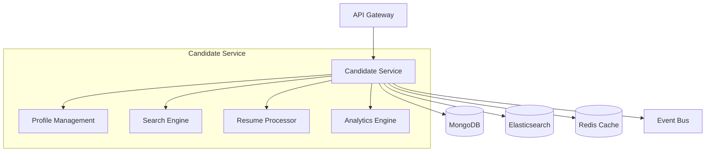
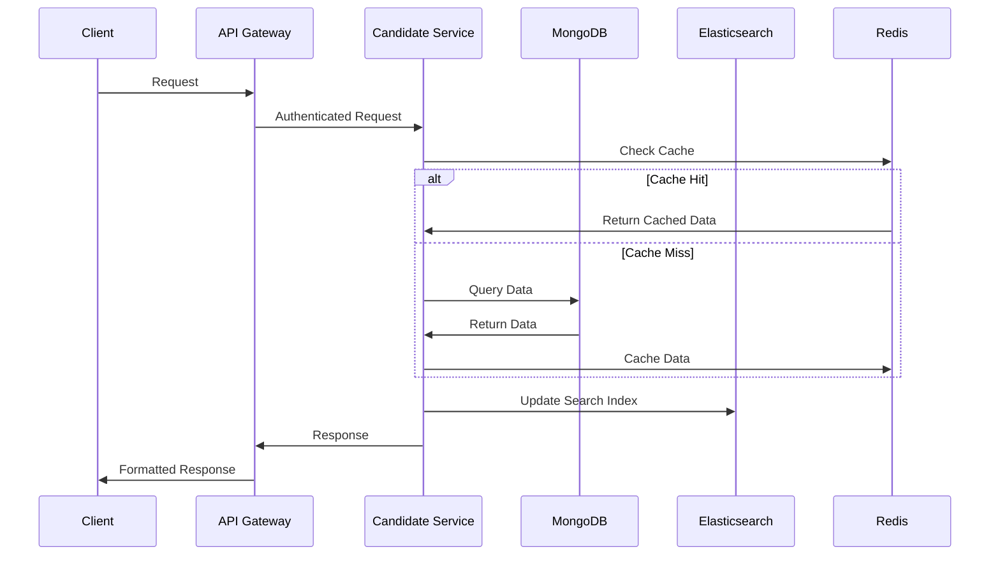

# Candidate Service

## Overview

The Candidate Service is a core microservice within the RefactorTrack Applicant Tracking System (ATS), responsible for managing candidate profiles, processing resumes, and providing advanced search capabilities. Built on Node.js with TypeScript, this service implements a scalable architecture designed for high availability and performance.

### Key Capabilities
- Candidate profile management
- Resume parsing and processing
- Advanced candidate search and matching
- Skills assessment and tracking
- Communication history management



## Features

### Profile Management
- CRUD operations for candidate profiles
- Document management (resumes, certifications)
- Version history tracking
- Data validation and sanitization

### Search Capabilities
- Full-text search across all candidate data
- Skills-based matching
- Location-based filtering
- Experience level matching
- Intelligent ranking algorithms

### Integration Points
- Job Requisition Service
- Communication Service
- Analytics Service
- Document Storage Service

## Architecture

### Technology Stack
- Runtime: Node.js 18.0.0+
- Language: TypeScript 5.0+
- Primary Database: MongoDB 7.0+
- Search Engine: Elasticsearch 8.0+
- Cache Layer: Redis 7.0+
- Message Queue: RabbitMQ
- Monitoring: DataDog

### Data Flow Architecture



## Prerequisites

### System Requirements
- Node.js >=18.0.0
- npm 9.0+
- Docker 24.0+
- Docker Compose 2.20+
- 4GB RAM minimum
- 2 CPU cores minimum

### Required Services
- MongoDB 7.0+
- Elasticsearch 8.0+
- Redis 7.0+
- DataDog Agent 7.0+

## Installation

### Local Development Setup

1. Clone the repository:
```bash
git clone <repository-url>
cd src/backend/services/candidate
```

2. Install dependencies:
```bash
npm install
```

3. Set up environment variables:
```bash
cp .env.example .env
# Edit .env with your configuration
```

4. Start required services:
```bash
docker-compose up -d
```

5. Run database migrations:
```bash
npm run migrate
```

6. Start development server:
```bash
npm run dev
```

## Configuration

### Environment Variables

| Variable | Description | Required | Default |
|----------|-------------|----------|---------|
| NODE_ENV | Environment mode | Yes | development |
| PORT | Service port | Yes | 3000 |
| MONGODB_URI | MongoDB connection string | Yes | - |
| ELASTICSEARCH_URL | Elasticsearch URL | Yes | - |
| REDIS_URL | Redis connection URL | Yes | - |
| JWT_SECRET | JWT verification secret | Yes | - |
| DD_API_KEY | DataDog API key | Yes | - |

### Service Configuration

```yaml
# config/default.yml
server:
  port: 3000
  cors:
    origins: ['http://localhost:3000']
    methods: ['GET', 'POST', 'PUT', 'DELETE']

mongodb:
  poolSize: 10
  retryWrites: true
  writeConcern: 'majority'

elasticsearch:
  indices:
    candidates: 'candidates_v1'
  replicas: 1
  shards: 5

redis:
  ttl: 3600
  maxSize: 1000
```

## API Documentation

### Base URL
```
/api/v1/candidates
```

### Endpoints

#### Profile Management
```
GET    /api/v1/candidates
POST   /api/v1/candidates
GET    /api/v1/candidates/:id
PUT    /api/v1/candidates/:id
DELETE /api/v1/candidates/:id
```

#### Search Operations
```
POST   /api/v1/candidates/search
GET    /api/v1/candidates/skills/:skill
GET    /api/v1/candidates/location/:location
```

#### Document Management
```
POST   /api/v1/candidates/:id/documents
GET    /api/v1/candidates/:id/documents
DELETE /api/v1/candidates/:id/documents/:documentId
```

## Development

### Code Style
- ESLint configuration with TypeScript support
- Prettier for code formatting
- Conventional commits required

### Testing
```bash
# Unit tests
npm run test

# Integration tests
npm run test:integration

# E2E tests
npm run test:e2e

# Coverage report
npm run test:coverage
```

## Deployment

### Docker Deployment
```bash
# Build image
docker build -t candidate-service:latest .

# Run container
docker run -p 3000:3000 --env-file .env candidate-service:latest
```

### Kubernetes Deployment
```yaml
# k8s/deployment.yml
apiVersion: apps/v1
kind: Deployment
metadata:
  name: candidate-service
spec:
  replicas: 3
  selector:
    matchLabels:
      app: candidate-service
  template:
    metadata:
      labels:
        app: candidate-service
    spec:
      containers:
      - name: candidate-service
        image: candidate-service:latest
        ports:
        - containerPort: 3000
```

## Monitoring

### DataDog Integration
- Request rate monitoring
- Error rate tracking
- Response time metrics
- Resource utilization
- Custom business metrics

### Health Checks
```
GET /health
GET /metrics
```

### Logging
- Structured JSON logging
- Log levels: ERROR, WARN, INFO, DEBUG
- Correlation IDs for request tracking
- PII data masking

## Security

### Authentication
- JWT-based authentication
- Token validation middleware
- Role-based access control

### Data Protection
- Field-level encryption for sensitive data
- Data masking in logs
- GDPR compliance measures

## Troubleshooting

### Common Issues
1. Connection timeouts
2. Memory issues
3. Search performance degradation
4. Cache invalidation problems

### Debugging
```bash
# Enable debug logs
DEBUG=candidate-service:* npm run dev

# Profile memory usage
NODE_OPTIONS="--inspect" npm run dev
```

## Support

### Contact Information
- Technical Lead: [email]
- DevOps Team: [email]
- Security Team: [email]

### SLA
- Response Time: 15 minutes (P1)
- Resolution Time: 2 hours (P1)
- Availability: 99.9%

## Version History

### Current Version: 1.0.0
- Initial release with core functionality
- Candidate profile management
- Advanced search capabilities
- Integration with core services

### Upcoming Version: 1.1.0
- Enhanced search algorithms
- Batch processing capabilities
- Performance optimizations
- Additional integration points