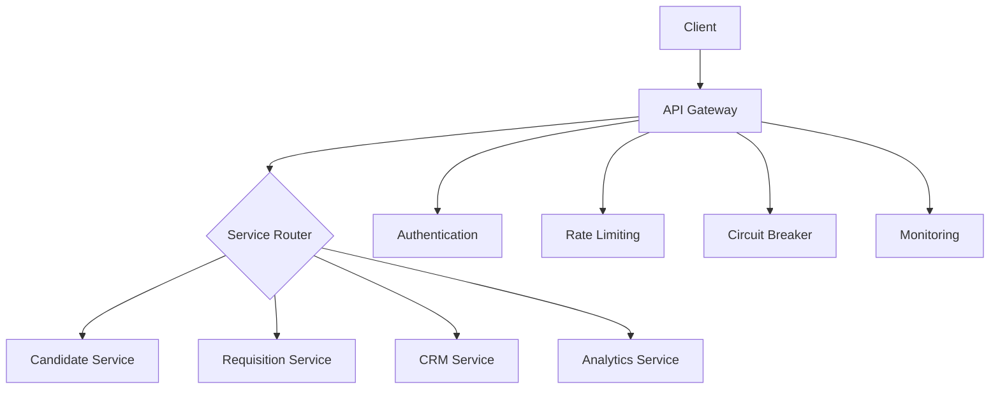
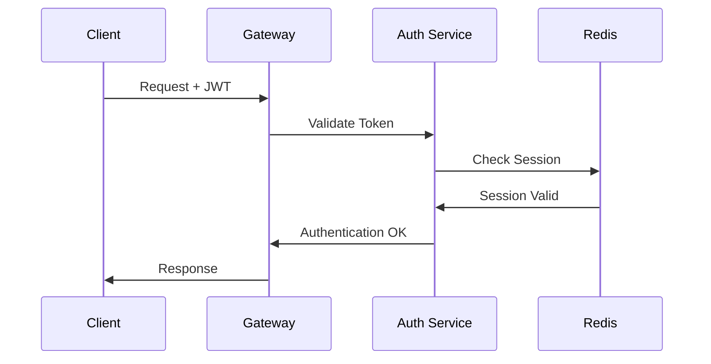

# RefactorTrack API Gateway Service

## Overview

The RefactorTrack API Gateway service acts as the central entry point for all client requests to the microservices architecture. It provides robust request routing, authentication, security controls, and comprehensive monitoring capabilities.

Version: 1.0.0

## Table of Contents

- [Architecture](#architecture)
- [Features](#features)
- [Getting Started](#getting-started)
- [Configuration](#configuration)
- [Security](#security)
- [Monitoring](#monitoring)
- [Development](#development)
- [API Documentation](#api-documentation)

## Architecture

### High-Level Design



### Core Components

- **Service Router**: Intelligent request routing with load balancing
- **Authentication**: JWT-based with session management
- **Security Controls**: Comprehensive security middleware stack
- **Circuit Breaker**: Fault tolerance for service calls
- **Monitoring**: Integrated metrics and tracing

## Features

### Request Routing
- Dynamic service discovery and routing
- Load balancing with health checks
- Circuit breaker pattern implementation
- Configurable timeouts and retries

### Security
- JWT authentication with refresh tokens
- Role-based access control (RBAC)
- Rate limiting per client/endpoint
- Security headers (CORS, CSP, etc.)
- Request sanitization
- Session management

### Monitoring
- Request/response metrics
- Circuit breaker status
- Error tracking
- Performance monitoring
- Distributed tracing

## Getting Started

### Prerequisites

```bash
Node.js >= 18.x
Redis >= 7.x
```

### Installation

```bash
# Install dependencies
npm install

# Configure environment
cp .env.example .env

# Start service
npm run start
```

### Environment Variables

```bash
# Server Configuration
GATEWAY_PORT=3000
NODE_ENV=development

# Security
JWT_SECRET=your-secret-key
JWT_AUDIENCE=refactortrack-api
JWT_ISSUER=refactortrack

# Redis Configuration
REDIS_HOST=localhost
REDIS_PORT=6379
REDIS_PASSWORD=your-password

# Rate Limiting
RATE_LIMIT_WINDOW=60000
RATE_LIMIT_MAX_REQUESTS=1000
```

## Configuration

### Service Routes

```typescript
const serviceRoutes = {
  candidates: {
    path: '/api/v1/candidates',
    target: 'http://candidate-service:3001',
    timeout: 30000
  },
  requisitions: {
    path: '/api/v1/requisitions',
    target: 'http://requisition-service:3002',
    timeout: 30000
  },
  crm: {
    path: '/api/v1/clients',
    target: 'http://crm-service:3003',
    timeout: 30000
  },
  analytics: {
    path: '/api/v1/analytics',
    target: 'http://analytics-service:3004',
    timeout: 60000
  }
};
```

### Circuit Breaker Configuration

```typescript
const circuitBreakerConfig = {
  failureThreshold: 5,
  resetTimeout: 30000,
  monitorInterval: 10000
};
```

## Security

### Authentication Flow



### Security Headers

```typescript
const securityHeaders = {
  contentSecurityPolicy: true,
  crossOriginEmbedderPolicy: true,
  crossOriginOpenerPolicy: true,
  crossOriginResourcePolicy: true,
  dnsPrefetchControl: true,
  frameguard: { action: 'deny' },
  hidePoweredBy: true,
  hsts: true,
  ieNoOpen: true,
  noSniff: true,
  originAgentCluster: true,
  permittedCrossDomainPolicies: true,
  referrerPolicy: true,
  xssFilter: true
};
```

## Monitoring

### Metrics Collection

- Request counts by endpoint
- Response times
- Error rates
- Circuit breaker status
- Rate limiting metrics

### Health Check Endpoint

```
GET /health
```

Response:
```json
{
  "status": "UP",
  "timestamp": "2023-10-20T10:00:00Z",
  "services": {
    "candidate-service": { "status": "UP" },
    "requisition-service": { "status": "UP" },
    "crm-service": { "status": "UP" },
    "analytics-service": { "status": "UP" }
  }
}
```

## Development

### Local Setup

```bash
# Install dependencies
npm install

# Start in development mode
npm run dev

# Run tests
npm run test

# Build for production
npm run build
```

### Testing

```bash
# Unit tests
npm run test:unit

# Integration tests
npm run test:integration

# E2E tests
npm run test:e2e
```

## API Documentation

### Authentication Endpoints

```
POST /api/v1/auth/login
POST /api/v1/auth/refresh
POST /api/v1/auth/logout
```

### Service Endpoints

```
GET /api/v1/candidates/**
GET /api/v1/requisitions/**
GET /api/v1/clients/**
GET /api/v1/analytics/**
```

### Monitoring Endpoints

```
GET /health
GET /metrics
```

## Contributing

Please refer to CONTRIBUTING.md for development guidelines and coding standards.

## License

Copyright (c) 2023 RefactorTrack. All rights reserved.